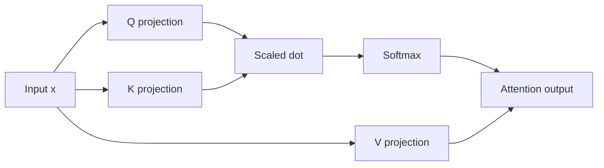
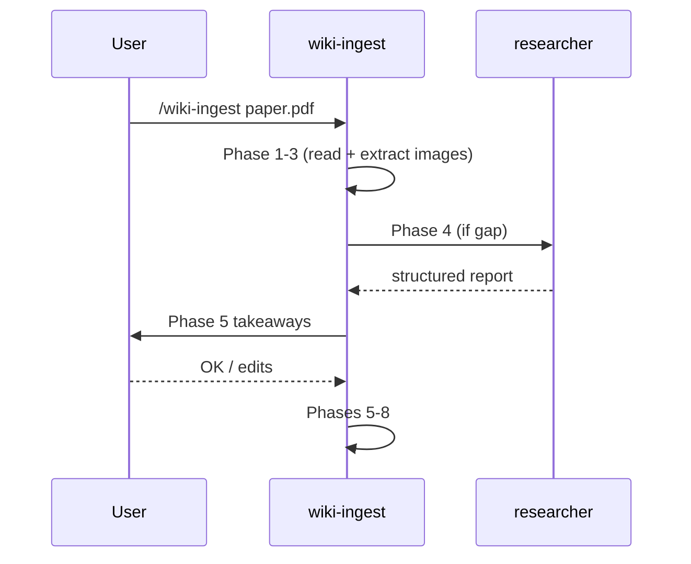

# Illustration Policy — Full Manual

Short regulation: `.claude/rules/03-illustration-policy.md`.
This file is the workflow `wiki-ingest` phase 7 uses to pick a tool and produce the figure.

## Tool chooser

For each non-trivial concept on the page, ask in order:

1. **Is it a relation between named pieces (architecture, data flow, dependency graph)?**
   → Mermaid. Inline in markdown.

2. **Is it a function plot, a numerical example, or a curve to compare?**
   → Matplotlib. Script + PNG.

3. **Is it a geometric or visual idea the original paper already drew well?**
   → Source figure cut-out with attribution.

4. **Is it none of the above but still non-trivial?**
   → Add an "Открытые вопросы" bullet to the breakdown page («как нарисовать <концепт>») and move on. Do not skip silently.

## Mermaid recipes

### Architecture (named blocks, data flow)




Caption format: `*Diagram: <what it shows>*`

### Sequence (temporal order, e.g., training loop)



### Limits

- ≤ 12 nodes. Beyond that, the diagram becomes a web and is unreadable. Split into two diagrams or switch to matplotlib.
- No math inside mermaid node labels (Quartz mermaid rendering of LaTeX is unreliable). Use simple text.

## Matplotlib recipes

### File layout

Flat directory. Every figure named `<page-slug>-<figure-name>.png`:

```
wiki/static/figures/
├── su-2021-roformer-rotation-2d.png
├── su-2021-roformer-frequency-spectrum.png
├── vaswani-2017-attention-is-all-you-need-softmax-saturation.png
└── ...
```

No per-page subfolders. The slug prefix in the filename prevents collisions between papers (two papers can both have a figure called `architecture` — the slug distinguishes them).

### Script template

```python
"""Generates su-2021-roformer-rotation-2d.png for wiki/papers/su-2021-roformer.md."""
from pathlib import Path

import matplotlib.pyplot as plt
import numpy as np

OUT = Path(__file__).parent / "su-2021-roformer-rotation-2d.png"

def main() -> None:
    fig, ax = plt.subplots(figsize=(4, 4), dpi=120)
    # ... build the figure here
    fig.tight_layout()
    fig.savefig(OUT, dpi=120, bbox_inches="tight")
    plt.close(fig)

if __name__ == "__main__":
    main()
```

Write the script to a scratch location (e.g., `/tmp/<slug>-<name>.py` or alongside `OUT`), run it, then delete the `.py` once the `.png` is verified — only PNGs are committed. The script is one-shot; the recipe lives in the wiki-ingest conversation that produced it, not in the repo.

Caption format on the wiki page:

```markdown

```

No «*Generated: ...*» italic line — the script is gone. The alt text plus the lead-in / walk-out prose around the figure carry the context.

The image path is **file-relative** (`../static/figures/...`), not absolute (`/static/figures/...`). File-relative paths work both in Quartz (which resolves them at build time) and in any standalone viewer (file:// open, Obsidian, GitHub markdown preview). Absolute paths beginning with `/` work only inside Quartz's HTTP server and break in every other context.

### PNG size

Target ≤ 200 KB. Strategies if exceeded:
- Lower `dpi` to 96 or 80.
- Simplify the figure (drop secondary curves).
- Use `optimize=True` if going through PIL (not default in matplotlib).

## Source cut-outs

When the original paper has a figure that no reimplementation will beat (e.g., a geometric construction):

1. Prefer the **extracted source images** from wiki-ingest Phase 3 (PDFs via `pdfimages`, DOCX via `word/media/` unzip, HTML via `` href fetch). Manual screenshot is the fallback.
2. Save to `wiki/static/figures/<page-slug>-fig<N>-cutout.png` (or `<page-slug>-source-<n>.png`).
3. Caption on the page (attribution **mandatory**):
   ```markdown
   
   *From Su et al. (2021), Fig. 2.*
   ```
4. PNG size ≤ 200 KB. Crop tightly; do not include the whole page.

**Attribution is mandatory.** A cut-out without attribution is a copyright violation and a quality regression — readers cannot trace the claim.

## Phase 7 checklist (run for each page produced in phase 6)

```
For each non-trivial concept on the page:
  [ ] Tool chosen (mermaid / matplotlib / cut-out / question filed)
  [ ] Figure produced and saved at wiki/static/figures/<slug>-<name>.png
  [ ] PNG ≤ 200 KB
  [ ] Matplotlib .py executed and then deleted (no .py left in figures/)
  [ ] Cut-out has full attribution (author, year, figure number)
  [ ] Mermaid ≤ 12 nodes
  [ ] No AI-generated images anywhere
  [ ] Image referenced from markdown via file-relative path (../static/figures/...)
  [ ] Lead-in + walk-out sentences in the prose around the image
```
