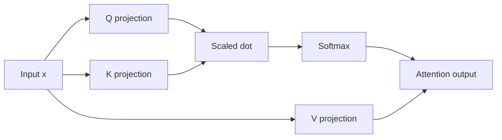
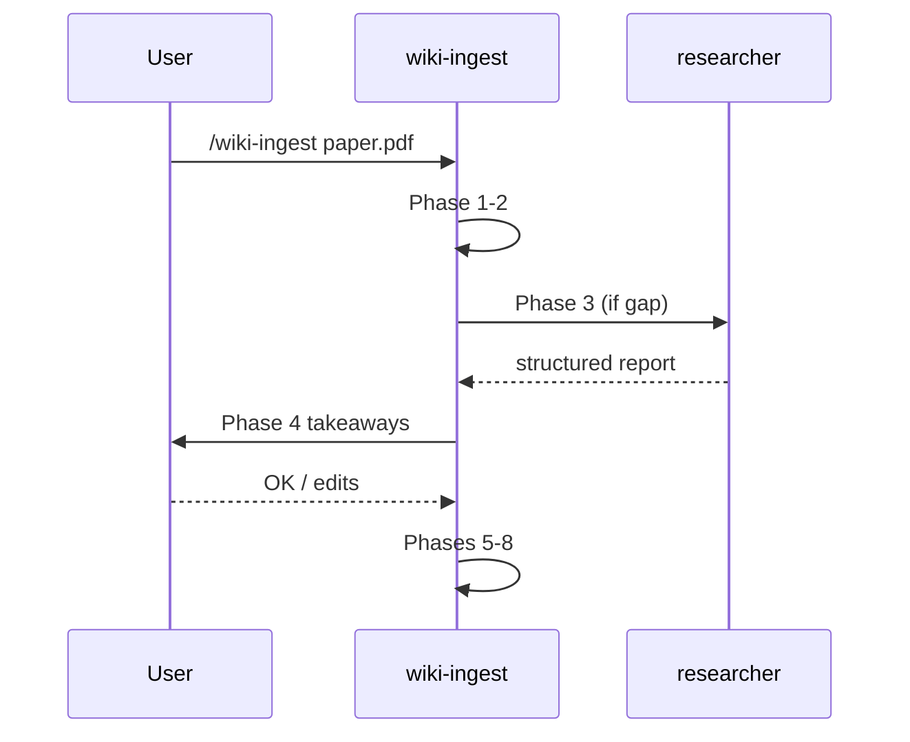

# Illustration Policy — Full Manual

Short regulation: `.claude/rules/03-illustration-policy.md`.
This file is the workflow `wiki-ingest` phase 6 uses to pick a tool and produce the figure.

## Tool chooser

For each non-trivial concept on the page, ask in order:

1. **Is it a relation between named pieces (architecture, data flow, dependency graph)?**
   → Mermaid. Inline in markdown.

2. **Is it a function plot, a numerical example, or a curve to compare?**
   → Matplotlib. Script + PNG.

3. **Is it a geometric or visual idea the original paper already drew well?**
   → Source figure cut-out with attribution.

4. **Is it none of the above but still non-trivial?**
   → File `wiki/questions/how-to-illustrate-<concept>.md` and move on. Do not skip silently.

## Mermaid recipes

### Architecture (named blocks, data flow)



Caption format: `*Diagram: <what it shows>*`

### Sequence (temporal order, e.g., training loop)



### Limits

- ≤ 12 nodes. Beyond that, the diagram becomes a web and is unreadable. Split into two diagrams or switch to matplotlib.
- No math inside mermaid node labels (Quartz mermaid rendering of LaTeX is unreliable). Use simple text.

## Matplotlib recipes

### File layout

```
wiki/static/figures/<page-slug>/
├── <figure-name>.py
└── <figure-name>.png
```

Example for `wiki/ml_concepts/attention/positional-encodings/rope.md`:

```
wiki/static/figures/rope/
├── rotation-2d.py
└── rotation-2d.png
```

### Script template

```python
"""Generates rotation-2d.png for wiki/ml_concepts/attention/positional-encodings/rope.md."""
from pathlib import Path

import matplotlib.pyplot as plt
import numpy as np

OUT = Path(__file__).parent / "rotation-2d.png"

def main() -> None:
    fig, ax = plt.subplots(figsize=(4, 4), dpi=120)
    # ... build the figure here
    fig.tight_layout()
    fig.savefig(OUT, dpi=120, bbox_inches="tight")
    plt.close(fig)

if __name__ == "__main__":
    main()
```

Run: `python wiki/static/figures/<page-slug>/<name>.py`

Caption format on the wiki page:

```markdown

*Generated: figures/rope/rotation-2d.py*
```

### PNG size

Target ≤ 200 KB. Strategies if exceeded:
- Lower `dpi` to 96 or 80.
- Simplify the figure (drop secondary curves).
- Use `optimize=True` if going through PIL (not default in matplotlib).

## Source cut-outs

When the original paper has a figure that no reimplementation will beat (e.g., a geometric construction):

1. Take a screenshot of the figure (macOS: Cmd+Shift+4, save as PNG).
2. Save to `wiki/static/figures/<page-slug>/source-cut-<short-name>.png`.
3. Caption on the page:
   ```markdown
   
   *From Su et al. (2021), Fig. 2.*
   ```
4. PNG size ≤ 200 KB. Crop tightly; do not screenshot the whole page.

**Attribution is mandatory.** A cut-out without attribution is a copyright violation and a quality regression — readers cannot trace the claim.

## Phase 6 checklist (run for each page produced in phase 5)

```
For each non-trivial concept on the page:
  [ ] Tool chosen (mermaid / matplotlib / cut-out / question filed)
  [ ] Figure produced and saved at the right path
  [ ] Caption written under the figure with the right format
  [ ] PNG ≤ 200 KB
  [ ] Matplotlib script committed alongside the PNG
  [ ] Cut-out has full attribution (author, year, figure number)
  [ ] Mermaid ≤ 12 nodes
  [ ] No AI-generated images anywhere
```
