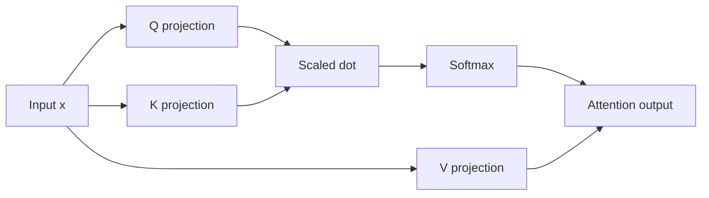
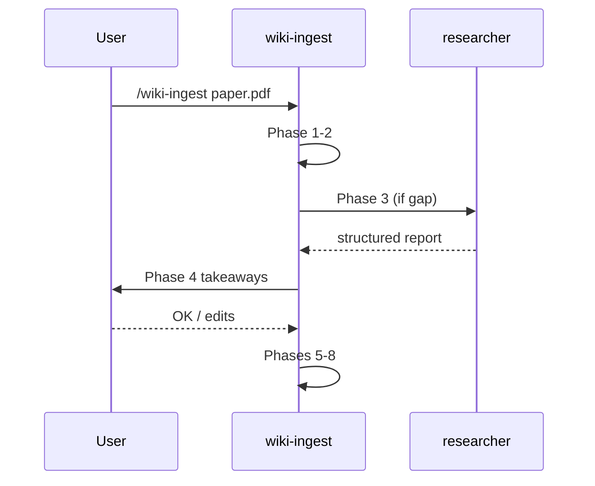

# Wiki Overhaul Implementation Plan

> **For agentic workers:** REQUIRED SUB-SKILL: Use superpowers:subagent-driven-development (recommended) or superpowers:executing-plans to implement this plan task-by-task. Steps use checkbox (`- [ ]`) syntax for tracking.

**Goal:** Reshape `knowledge_sharing_wiki` into a self-contained, role-driven, hierarchically-organised LLM-maintained wiki with a single `wiki-ingest` workflow, lightweight rules, persistent session memory (`.autodoc/`), and onboarding for new colleagues.

**Architecture:** One source-of-truth role file (`.claude/role.md`), four auto-loaded rules (`.claude/rules/*.md`), one research subagent (`wiki-source-researcher`), one rewritten entrypoint skill (`wiki-ingest` v2) that reads shared references (`.claude/skills/_shared/*.md`) and orchestrates 8 phases, plus `autodoc` skill for session memory. Existing wiki pages migrated into 2-level hierarchy under `ml_concepts/{attention,probabilistic,generative}` and `methods/{architectures,attention,distillation,generative,inference,positional}` without text rewrite (flagged `needs_rewrite: true`).

**Tech Stack:** Markdown (Quartz/Obsidian-flavoured), Mermaid for diagrams, matplotlib for plots, Quartz for static site generation, Vercel for deploy. No code dependencies introduced — this is a content + workflow change.

**Spec:** `docs/superpowers/specs/2026-05-17-wiki-overhaul-design.md`

**Branch:** `wiki-overhaul` (already created, commit `9ff9bc6`)

**Commit policy:** ≤ 300 changed lines per commit, conventional commits, **no `git push`**.

---

## File Structure

### New files

```
CLAUDE.md                                          # rewritten, ≤ 100 lines
AGENTS.md                                          # short-pointer
ONBOARDING.md                                      # ~120-180 lines
.autodoc/index.md
.autodoc/insights.md
.claude/role.md                                    # ~80-120 lines
.claude/rules/01-language-policy.md
.claude/rules/02-commit-policy.md
.claude/rules/03-illustration-policy.md
.claude/rules/04-frontmatter-schema.md
.claude/agents/wiki-source-researcher.md
.claude/skills/_shared/README.md
.claude/skills/_shared/page-templates.md
.claude/skills/_shared/illustration-policy.md
.claude/skills/_shared/russian-style.md
.claude/skills/autodoc/SKILL.md
```

### Modified files

```
.claude/skills/wiki-ingest/SKILL.md                # full rewrite
.claude/skills/wiki-lint/SKILL.md                  # minor, hierarchy + rules/04 ref
.claude/skills/wiki-query/SKILL.md                 # minor, read .claude/role.md
wiki/index.md                                      # under new hierarchy
```

### Moved files (git mv)

```
wiki/ml_concepts/*.md   → wiki/ml_concepts/{attention|probabilistic|generative}/...
wiki/methods/*.md       → wiki/methods/{architectures|attention|distillation|generative|inference|positional}/...
```

Migration map is in Task 12-13.

### Untouched

- `raw/**`
- `publish/**` (except adding `publish/static/figures/...` during the verification ingest in Task 26)
- `vercel.json`
- `wiki/log.md` (only append via verification ingest)
- `wiki/math_concepts/*.md`, `wiki/topics/*.md`, `wiki/sources/*.md`, `wiki/questions/*.md` (stay flat)
- `README.md` (re-read at end of plan, no changes expected)

---

## Task 1: Create `.claude/rules/01-language-policy.md`

**Files:**
- Create: `.claude/rules/01-language-policy.md`

- [ ] **Step 1: Write the file**

Content:

```markdown
# Language Policy

This rule auto-loads. It applies to all wiki content and skill output.

## Where which language

| Surface | Language |
|---|---|
| Prose body of pages under `wiki/{ml_concepts,math_concepts,methods,topics,sources,questions}` | Russian |
| Frontmatter `title:`, H1 of every wiki page | English |
| Filenames, slugs, tags, `[[wiki-links]]` | English (kebab-case) |
| Service files: `CLAUDE.md`, `AGENTS.md`, `wiki/index.md`, `wiki/log.md`, `.claude/skills/**`, `.claude/rules/**`, `.claude/role.md`, `ONBOARDING.md` | English |
| Section headings inside wiki pages | English |
| Commit messages, PR descriptions | English |

## Russian prose rules

ML and math terms stay English inside Russian prose: flow matching, attention, score matching, KL divergence, posterior, prior, embedding, latent, ELBO, autoencoder, gradient, softmax, dropout, EMA. Do **not** transliterate (`флоу-матчинг`, `постериор`) and do **not** over-translate (`нижняя граница доказательства` for ELBO).

Common words with stable Russian equivalents — «градиент», «вероятность», «распределение», «выборка» — pick whichever reads cleaner in context.

### Banned constructions

**Bureaucratic fillers** — never write:
- «является», «осуществляется», «представляет собой»
- «в данной работе», «в данной статье», «в данной заметке»
- «следует отметить, что», «стоит отметить»
- «производится», «имеет место»

**AI-speak openings** — never write:
- «давайте разберёмся», «погрузимся в»
- «как мы знаем», «как известно», «не случайно»
- «итак», «в заключение», «подводя итог»
- «важно понимать, что»

**Marketing epithets** — never write:
- «мощный», «впечатляющий», «революционный»
- «передовой», «прорывной», «инновационный»

**Calque anglicisms** — replace with standard Russian ML terms:
- «бэкпропагейтить» → обратное распространение
- «энкодить», «декодить» → кодировать, декодировать
- «лосс падает» → функция потерь убывает
- «зафайнтюнить» → дообучить

## Verification (during `wiki-lint`)

Grep prose for any banned construction. Each match is a finding to surface.
```

- [ ] **Step 2: Verify file is well-formed**

Read the file back. Check:
- File starts with `# Language Policy`
- All three banned-construction sections present
- File length 50-90 lines.

Run: `wc -l .claude/rules/01-language-policy.md`
Expected: between 50 and 90.

- [ ] **Step 3: Commit**

```bash
mkdir -p .claude/rules
git add .claude/rules/01-language-policy.md
git commit -m "feat(rules): add 01-language-policy"
```

---

## Task 2: Create `.claude/rules/02-commit-policy.md`

**Files:**
- Create: `.claude/rules/02-commit-policy.md`

- [ ] **Step 1: Write the file**

Content:

```markdown
# Commit Policy

This rule auto-loads. It applies to all git operations in this repo.

## Size

- ≤ 300 changed lines per commit.
- If a task produces more, split into atomic commits: migration / new pages / illustrations / skill changes, each separately.
- Each commit is self-contained and passes Quartz build independently.

## Format

Conventional commits with scope. Common scopes:

| Scope | Use for |
|---|---|
| `feat(wiki)` | New page, new section in an existing page |
| `feat(wiki)` | Ingest a new source: `feat(wiki): ingest <source> — <short-desc>` |
| `fix(wiki)` | Broken link, frontmatter typo, factual correction |
| `refactor(wiki)` | Move pages between subfolders, rename slugs |
| `docs(skill)` | Update a SKILL.md or `.claude/role.md` |
| `feat(rules)` | New or rewritten rule |
| `chore(autodoc)` | Append session insights: `chore(autodoc): session insights — YYYY-MM-DD` |

Subject line ≤ 72 chars. Body in English, wrapped at 80 cols.

## What to commit

| Path | Commit? |
|---|---|
| `wiki/**` | Yes |
| `raw/**` | Yes — sources are part of history |
| `.autodoc/**` | Yes — persistent session memory |
| `.claude/**` | Yes — config and skills |
| `publish/static/figures/**` | Yes — only generated PNGs ≤ 200 KB |
| `publish/node_modules/`, `publish/.quartz-cache/` | No — gitignore |
| `publish/public/` (Quartz build output) | No — gitignore |

PNGs > 200 KB are rejected. Lower DPI or simplify the figure.

## Push

- **Claude never runs `git push`**, regardless of branch or instruction.
- Push is a manual user action only.
- `main` deploys to Vercel on push. Run `/wiki-lint` before pushing.

## Branches

- `main` — what gets deployed.
- Significant changes (more than ~3 commits) → feature branch like `wiki-overhaul`, `migrate-attention`.
- Single typo fixes — directly in `main` is fine.
```

- [ ] **Step 2: Verify file**

Run: `wc -l .claude/rules/02-commit-policy.md`
Expected: between 40 and 80.

- [ ] **Step 3: Commit**

```bash
git add .claude/rules/02-commit-policy.md
git commit -m "feat(rules): add 02-commit-policy"
```

---

## Task 3: Create `.claude/rules/03-illustration-policy.md`

**Files:**
- Create: `.claude/rules/03-illustration-policy.md`

- [ ] **Step 1: Write the file**

Content:

```markdown
# Illustration Policy

This rule auto-loads. Full manual with chooser logic lives in `.claude/skills/_shared/illustration-policy.md` and is read by `wiki-ingest` phase 6.

## Allowed tools

| Tool | When to use |
|---|---|
| Mermaid | Architectures, data flows, relationships between concepts. Inline in markdown. |
| Matplotlib (Python) | Plots, function visualisations, numerical examples. `.py` + `.png` under `publish/static/figures/<page-slug>/`. |
| Numpy/Torch + matplotlib | Numerical examples with small concrete values. Same location. |
| Source figure cut-out | Complex schemes that are better in original form than a reimplementation. `publish/static/figures/<page-slug>/source-cut-*.png`. Attribution mandatory. |

## Forbidden

- **AI image generation** (DALL·E, Stable Diffusion, Midjourney, any model). Cost of wrong-but-pretty exceeds value.
- **Hand-drawn Excalidraw / manual SVG** inside the auto-flow. If hand-drawn is desired, it ships as a separate manual commit after `/wiki-ingest`.
- **TikZ / LaTeX figures** — overkill for Quartz, brittle render.
- **Screenshots of slides or talks without attribution.**

## Required for every figure

1. Caption directly under the image:
   - Mermaid: `*Diagram: <what it shows>*`
   - Matplotlib: `*Generated: figures/<slug>/<file>.py*`
   - Cut-out: `*From <First Author> et al. (<year>), Fig. <N>.*`
2. PNG size ≤ 200 KB. If exceeded, lower DPI or simplify.
3. Filename: kebab-case, no spaces. `rope-rotation-2d.png`, not `RoPE rotation (2D).png`.
4. One figures folder per page: `publish/static/figures/<page-slug>/`. No shared dumping ground.
5. Mermaid: ≤ 12 nodes. Beyond that, split into two diagrams or switch to matplotlib.
6. Matplotlib `.py` scripts commit **alongside** the PNG. Reproducibility is mandatory.

## Coverage rule

Every non-trivial concept on a wiki page must have at least one illustration. If a concept is genuinely impossible to illustrate, file a question page (`wiki/questions/how-to-illustrate-<concept>.md`) instead of skipping silently.
```

- [ ] **Step 2: Verify file**

Run: `wc -l .claude/rules/03-illustration-policy.md`
Expected: between 40 and 70.

- [ ] **Step 3: Commit**

```bash
git add .claude/rules/03-illustration-policy.md
git commit -m "feat(rules): add 03-illustration-policy"
```

---

## Task 4: Create `.claude/rules/04-frontmatter-schema.md`

**Files:**
- Create: `.claude/rules/04-frontmatter-schema.md`

- [ ] **Step 1: Write the file**

Content:

```markdown
# Frontmatter Schema

This rule auto-loads. `wiki-lint` enforces it. Every wiki page starts with YAML frontmatter matching the schema below.

## Common fields (every page)

```yaml
---
title: <Human-readable, English, capitalised>
type: <one of: ml_concept | math_concept | method | topic | source | question>
tags: [<lowercase>, <kebab-case>, <plural-where-natural>]
created: YYYY-MM-DD
updated: YYYY-MM-DD
sources: <integer; count of distinct raw sources cited>
status: <one of: stub | draft | mature>
needs_rewrite: <optional, bool; true when migrated without rewrite>
---
```

### Field rules

- `title`: English, capitalised. The filename is the slug (kebab-case).
- `type`: matches the directory the file lives in.
- `tags`: lowercase, kebab-case. Plural where natural (`transformers`, not `transformer`).
- `created` / `updated`: ISO date. Update `updated` on substantive changes; do not bump for typo fixes.
- `sources`: integer count of distinct raw sources cited. Bump on new citation; do not double-count.
- `status`:
  - `stub` — exists because someone linked to it; minimal content.
  - `draft` — substantive content from at least one source.
  - `mature` — cross-referenced, multi-source, synthesis stable.
- `needs_rewrite: true` — set during migration when the page was moved but text not yet rewritten. Removed by the next `/wiki-ingest` that revises the page.

## Source pages — additional fields

```yaml
---
title: "<First Author> — <short title>"
type: source
source_path: raw/<kind>/<file>
source_kind: <one of: paper | clip | scratch | lecture | other>
source_date: YYYY-MM-DD
ingested: YYYY-MM-DD
tags: [...]
status: <stub | draft | mature>
---
```

- `source_path`: relative to repo root. Validate the file exists.
- `source_date`: when the source was published (not when ingested).
- `ingested`: when this source page was created.

## Validation rules (enforced by `wiki-lint`)

1. Every file under `wiki/` starts with `---` on line 1.
2. All common fields present and non-empty.
3. `type` matches enclosing directory (e.g., `wiki/ml_concepts/.../*.md` has `type: ml_concept`).
4. `created` ≤ `updated`.
5. `tags` is non-empty.
6. Source pages have all source-specific fields.
7. `status` is one of the three values.
```

- [ ] **Step 2: Verify**

Run: `wc -l .claude/rules/04-frontmatter-schema.md`
Expected: between 50 and 80.

- [ ] **Step 3: Commit**

```bash
git add .claude/rules/04-frontmatter-schema.md
git commit -m "feat(rules): add 04-frontmatter-schema"
```

---

## Task 5: Create `.claude/role.md`

**Files:**
- Create: `.claude/role.md`

- [ ] **Step 1: Write the file**

Content:

```markdown
# Wiki Author Role

Read this whenever you act on the wiki. Every skill in `.claude/skills/` opens with `Read .claude/role.md` as its first pre-flight step.

## Who you are

LLM author of a personal ML wiki. You read sources from `raw/`, then write and maintain structured pages in `wiki/`. You do not summarise — you integrate every source into a network of concept pages.

## What you deliver to the reader

- A clear explanation, not a retelling of a paper.
- Motivated build-up: what we want → naive approach → why it fails → what this concept introduces. Every non-trivial idea follows this arc.
- An illustration for every non-trivial idea (mermaid, matplotlib, or a captioned source cut-out).
- Direct prose. No hedging. No marketing. No metaphors that compare ML to human intuition unless the source itself uses them.

## Voice

- Direct, calm, no hype.
- No calque anglicisms (`бэкпропагейтить`, `энкодить`, `лосс падает`). Use the standard Russian ML lexicon: обратное распространение, кодировать, функция потерь. English stays for proper names (Transformer, RoPE) and headings/slugs/tags. Full banned list in `.claude/rules/01-language-policy.md`.
- No AI-speak: «давайте», «итак», «в данной статье», «как видно», «стоит отметить».
- No clerical phrasing: «осуществляется», «представляет собой», «является».
- No stretched metaphors. Attention is not «human focus». Softmax is not «voting».

## What you do not do

- Do not modify `raw/`. Sources are immutable.
- Do not skip illustrations on non-trivial concepts. A mermaid in 3 nodes beats a wall of text.
- Do not invent facts. If the source has a gap, you either dispatch `wiki-source-researcher` or ask the user.
- Do not write a 2000-word wall. Length is dictated by content.
- Do not run `git push`. Ever. Commits are fine when explicitly requested.

## When in doubt

- Concept is contested → an "Open questions" section on the page, or a separate file in `wiki/questions/`.
- The text is not coming together → write a stub with links, set `status: stub`, move on.
- Source conflicts with what is already in the wiki → mark both versions with attribution. Do not silently overwrite.

## When to add a new subfolder

In `wiki/ml_concepts/<top>/<sub>/` — when an existing subfolder accumulates ~5 pages of one sub-topic and a natural boundary appears (e.g., `attention/` accumulates several positional-encoding pages → split off `attention/positional-encodings/`).

Hierarchy max depth: 2 levels inside `ml_concepts/` and `methods/`. Beyond that is over-engineering.

## Reading order at session start

1. `.claude/role.md` (this file)
2. `.claude/rules/` — auto-loaded; verify your output complies
3. `wiki/index.md` — what already exists
4. `.autodoc/index.md` — insights from previous sessions

You may skip 3 and 4 for narrow tasks (e.g., a single `/wiki-lint` run on one file), but never skip 1 and 2.
```

- [ ] **Step 2: Verify**

Run: `wc -l .claude/role.md`
Expected: between 60 and 100.

- [ ] **Step 3: Commit**

```bash
git add .claude/role.md
git commit -m "docs(role): add wiki author role"
```

---

## Task 6: Create `.claude/agents/wiki-source-researcher.md`

**Files:**
- Create: `.claude/agents/wiki-source-researcher.md`

- [ ] **Step 1: Write the file**

Content:

````markdown
---
name: wiki-source-researcher
description: Web research agent dispatched by `wiki-ingest` phase 3 when the primary source has a gap that blocks a clear explanation. Fetches and synthesises supporting material from the internet, returns a structured report. Never edits files in the repo; the main thread decides what to do with the findings.
model: opus
tools: WebSearch, WebFetch, Read
---

# wiki-source-researcher

You are dispatched by `wiki-ingest` when its primary source has a gap that blocks a clear explanation. Your task is narrow: fill the gap, return a structured report, do not touch the repo.

## Input

The caller gives you:
- The primary source title and what it claims.
- The specific gap (e.g., "the paper references Shaw et al. 2018 relative position encoding but doesn't define it; I need the formula, motivation, and limitations").
- Optional: links the caller already has.

## What you do

1. **Search.** Use `WebSearch` for the most authoritative source on the gap (original paper > survey > high-quality blog). Prefer 2-3 sources for triangulation.
2. **Fetch.** Use `WebFetch` (or `rdrr` if available via Bash) to read the sources fully. PDFs: `WebFetch` with explicit page hints, or `rdrr` for HTML mirrors.
3. **Synthesise.** Produce a report in the format below.

## Output format

Return exactly this structure:

```
## Gap being researched
<one-sentence restatement of what the caller needs>

## Sources consulted
- <URL> — <one-line on what it gave you>
- <URL> — ...

## Findings
<2-5 paragraphs of clear prose answering the gap. Math in LaTeX. Cite each
claim by linking back to a source. If sources disagree, state both positions.>

## Open uncertainties
- <what you could not pin down, and why>

## Suggested wiki impact
- <which existing wiki pages this affects, if any>
- <whether a new stub should be filed in wiki/questions/>
```

## Rules

- **Do not edit any file in the repo.** Your output is text returned to the caller.
- **Do not invent.** If a source contradicts itself or you cannot find authoritative material, say so in "Open uncertainties".
- **Stay narrow.** Answer the specific gap. Do not produce a general survey.
- **Cite specifically.** Every factual claim points back to a source URL.
- **Russian or English?** Findings prose can be in either — the caller will rewrite into the wiki's voice. Default to English for technical content; that is easier to fact-check.
````

- [ ] **Step 2: Verify**

Run: `wc -l .claude/agents/wiki-source-researcher.md`
Expected: between 50 and 80.

- [ ] **Step 3: Commit**

```bash
mkdir -p .claude/agents
git add .claude/agents/wiki-source-researcher.md
git commit -m "feat(agents): add wiki-source-researcher"
```

---

## Task 7: Create `.claude/skills/_shared/README.md`

**Files:**
- Create: `.claude/skills/_shared/README.md`

- [ ] **Step 1: Write the file**

Content:

````markdown
# `_shared/` — Read-on-Demand References

This folder holds reference documents that several skills read with explicit `Read` calls. They are **not** auto-loaded.

## Convention

A skill that depends on a `_shared/` reference does this at pre-flight:

```
1. Read `.claude/role.md`
2. Read `.claude/skills/_shared/page-templates.md`
3. Read `.claude/skills/_shared/illustration-policy.md`
4. Read `.claude/skills/_shared/russian-style.md`
```

Each `Read` is one explicit step in the skill's checklist.

## Why not auto-load?

These files are long (200-500 lines each). Auto-loading them all would burn context for every conversation. Skills load only what they need.

## Files

| File | Purpose | Loaded by |
|---|---|---|
| `page-templates.md` | Templates for ml_concept, math_concept, method, topic, source, question pages | `wiki-ingest` phase 5 |
| `illustration-policy.md` | Full manual with chooser logic for mermaid vs matplotlib vs cut-out | `wiki-ingest` phase 6 |
| `russian-style.md` | Detailed Russian style guide with examples | `wiki-ingest` phase 7 |

`.claude/role.md` lives at the `.claude/` root (not in `_shared/`) because it is shorter and conceptually a top-level identity file rather than a workflow reference.

## Adding a new `_shared/` file

Add it to the table above. Update the relevant skill's pre-flight checklist to read it. Do not implicitly couple a skill to a `_shared/` file without naming it in the skill's checklist.
````

- [ ] **Step 2: Verify**

Run: `wc -l .claude/skills/_shared/README.md`
Expected: between 30 and 50.

- [ ] **Step 3: Commit**

```bash
mkdir -p .claude/skills/_shared
git add .claude/skills/_shared/README.md
git commit -m "docs(skills): add _shared/ README"
```

---

## Task 8: Create `.claude/skills/_shared/page-templates.md`

**Files:**
- Create: `.claude/skills/_shared/page-templates.md`

- [ ] **Step 1: Port and adapt the page templates from current `CLAUDE.md`**

Read the existing templates from `CLAUDE.md` (sections "Page templates" — ML concept page, Math concept page, Method page, Topic page, Source page, Question page). Copy each template into the new file. Adjust:
- Drop the markdown wrapper-comment "## Page templates" header — start at top with `# Page Templates`.
- Above each template, add a one-paragraph "When to use" note (which `type:` it serves).
- Keep all current template content (motivation, formal description, sources, up next, etc.).
- Russian-prose body, English headings/slugs — match `rules/01`.

Final structure:

```markdown
# Page Templates

Read this in `wiki-ingest` phase 5. Pick the template matching the page `type:`.

## ML concept page (`type: ml_concept`)

When to use: an ML idea that exists independently of any single algorithm — attention, dropout, residual connection. The page belongs in `wiki/ml_concepts/<top>/<sub>/<slug>.md`.

<template body — copy from CLAUDE.md>

## Math concept page (`type: math_concept`)

When to use: a math object used in ML — KL divergence, softmax, rotation matrix. Walk every step. The page belongs in `wiki/math_concepts/<slug>.md` (flat).

<template body — copy from CLAUDE.md>

## Method page (`type: method`)

When to use: a specific algorithm or technique — AdamW, FlashAttention, LoRA. The page belongs in `wiki/methods/<top>/<slug>.md`.

<template body — copy from CLAUDE.md>

## Topic page (`type: topic`)

When to use: a narrative primer for a whole area — Optimization, Regularization, Attention Variants. The page belongs in `wiki/topics/<slug>.md` (flat).

<template body — copy from CLAUDE.md>

## Source page (`type: source`)

When to use: every ingested raw source gets one. The page belongs in `wiki/sources/<slug>.md` (flat).

<template body — copy from CLAUDE.md>

## Question page (`type: question`)

When to use: an open question that hasn't been resolved. The page belongs in `wiki/questions/<slug>.md` (flat).

<template body — copy from CLAUDE.md>

## Common conventions across all templates

- All frontmatter follows `rules/04-frontmatter-schema.md`.
- Prose body is Russian; headings, slugs, frontmatter values are English (`rules/01-language-policy.md`).
- Math in LaTeX, never in backticks (this carries over from existing CLAUDE.md guidance).
- `[[wiki-link]]` syntax for internal references.
- Page length: as long as needed, no longer. Soft target 200-1000 lines body; hard split at ~750 if a natural sub-concept emerges.
```

- [ ] **Step 2: Verify by running diff against the source templates**

Read the current `CLAUDE.md` "Page templates" section and confirm every template you copied has the same structure (Motivation / Formal description / etc. sections preserved verbatim).

Run: `wc -l .claude/skills/_shared/page-templates.md`
Expected: between 200 and 350.

- [ ] **Step 3: Commit**

```bash
git add .claude/skills/_shared/page-templates.md
git commit -m "docs(skills): add page-templates reference"
```

---

## Task 9: Create `.claude/skills/_shared/illustration-policy.md`

**Files:**
- Create: `.claude/skills/_shared/illustration-policy.md`

- [ ] **Step 1: Write the full manual**

This is the deep manual that `wiki-ingest` phase 6 reads. `rules/03-illustration-policy.md` is the short regulation; this file is the workflow.

Content:

````markdown
# Illustration Policy — Full Manual

Short regulation: `.claude/rules/03-illustration-policy.md`.
This file is the workflow `wiki-ingest` phase 6 uses to pick a tool and produce the figure.

## Tool chooser

For each non-trivial concept on the page, ask in order:

1. **Is it a relation between named pieces (architecture, data flow, dependency graph)?**
   → Mermaid. Inline in markdown.

2. **Is it a function plot, a numerical example, or a curve to compare?**
   → Matplotlib. Script + PNG.

3. **Is it a geometric or visual idea the original paper already drew well?**
   → Source figure cut-out with attribution.

4. **Is it none of the above but still non-trivial?**
   → File `wiki/questions/how-to-illustrate-<concept>.md` and move on. Do not skip silently.

## Mermaid recipes

### Architecture (named blocks, data flow)



Caption format: `*Diagram: <what it shows>*`

### Sequence (temporal order, e.g., training loop)



### Limits

- ≤ 12 nodes. Beyond that, the diagram becomes a web and is unreadable. Split into two diagrams or switch to matplotlib.
- No math inside mermaid node labels (Quartz mermaid rendering of LaTeX is unreliable). Use simple text.

## Matplotlib recipes

### File layout

```
publish/static/figures/<page-slug>/
├── <figure-name>.py
└── <figure-name>.png
```

Example for `wiki/ml_concepts/attention/positional-encodings/rope.md`:

```
publish/static/figures/rope/
├── rotation-2d.py
└── rotation-2d.png
```

### Script template

```python
"""Generates rotation-2d.png for wiki/ml_concepts/attention/positional-encodings/rope.md."""
from pathlib import Path

import matplotlib.pyplot as plt
import numpy as np

OUT = Path(__file__).parent / "rotation-2d.png"

def main() -> None:
    fig, ax = plt.subplots(figsize=(4, 4), dpi=120)
    # ... build the figure here
    fig.tight_layout()
    fig.savefig(OUT, dpi=120, bbox_inches="tight")
    plt.close(fig)

if __name__ == "__main__":
    main()
```

Run: `python publish/static/figures/<page-slug>/<name>.py`

Caption format on the wiki page:
````markdown

*Generated: figures/rope/rotation-2d.py*
````

### PNG size

Target ≤ 200 KB. Strategies if exceeded:
- Lower `dpi` to 96 or 80.
- Simplify the figure (drop secondary curves).
- Use `optimize=True` if going through PIL (not default in matplotlib).

## Source cut-outs

When the original paper has a figure that no reimplementation will beat (e.g., a geometric construction):

1. Take a screenshot of the figure (macOS: Cmd+Shift+4, save as PNG).
2. Save to `publish/static/figures/<page-slug>/source-cut-<short-name>.png`.
3. Caption on the page:
   ```markdown
   
   *From Su et al. (2021), Fig. 2.*
   ```
4. PNG size ≤ 200 KB. Crop tightly; do not screenshot the whole page.

**Attribution is mandatory.** A cut-out without attribution is a copyright violation and a quality regression — readers cannot trace the claim.

## Phase 6 checklist (run for each page produced in phase 5)

```
For each non-trivial concept on the page:
  [ ] Tool chosen (mermaid / matplotlib / cut-out / question filed)
  [ ] Figure produced and saved at the right path
  [ ] Caption written under the figure with the right format
  [ ] PNG ≤ 200 KB
  [ ] Matplotlib script committed alongside the PNG
  [ ] Cut-out has full attribution (author, year, figure number)
  [ ] Mermaid ≤ 12 nodes
  [ ] No AI-generated images anywhere
```
````

- [ ] **Step 2: Verify**

Run: `wc -l .claude/skills/_shared/illustration-policy.md`
Expected: between 130 and 220.

- [ ] **Step 3: Commit**

```bash
git add .claude/skills/_shared/illustration-policy.md
git commit -m "docs(skills): add illustration-policy manual"
```

---

## Task 10: Create `.claude/skills/_shared/russian-style.md`

**Files:**
- Create: `.claude/skills/_shared/russian-style.md`

- [ ] **Step 1: Write the file**

Content:

````markdown
# Russian Style Guide

Read this in `wiki-ingest` phase 7. Short regulation: `.claude/rules/01-language-policy.md`. This file is the deep guide with examples.

## Voice rules

### Direct, calm, no hype

Bad: «Attention — это революционный механизм, который изменил всё в NLP.»
Good: «Attention оценивает каждый key относительно query и взвешенно агрегирует values.»

### Motivated build-up arc

For every non-trivial concept, the prose follows: what we want → naive approach → why it fails → what the concept introduces.

Bad: «Rotary position embedding кодирует позицию через вращение.»
Good: «От позиционного кодирования хочется одного: чтобы dot-product между Q и K зависел только от относительной позиции m − n, а не от абсолютных m и n. Sinusoidal positional encoding этого свойства не даёт — оно складывает позицию с эмбеддингом аддитивно, и dot-product получает абсолютную позицию через произведение синусов. RoPE решает это, вращая Q и K в каждой парной плоскости на угол, пропорциональный позиции.»

## Banned constructions

### Bureaucratic fillers — never write

- «является» → use direct verb: «X — это Y» or «X делает Z».
  - Bad: «Softmax является функцией, которая нормирует логиты.»
  - Good: «Softmax нормирует логиты в распределение.»

- «представляет собой» → same fix.
  - Bad: «Attention представляет собой взвешенное усреднение.»
  - Good: «Attention — это взвешенное усреднение.»

- «осуществляется» → use active verb.
  - Bad: «Обновление весов осуществляется через backprop.»
  - Good: «Веса обновляются через backprop.»

- «в данной работе / статье / заметке» → drop entirely.
  - Bad: «В данной заметке мы рассмотрим RoPE.»
  - Good: <delete the sentence; the page title carries this info>

- «следует отметить, что» → drop or use «заметим».
  - Bad: «Следует отметить, что dot-product зависит от размерности.»
  - Good: «Dot-product зависит от размерности — отсюда множитель √d_k.»

### AI-speak openings — never write

- «давайте разберёмся» / «погрузимся в» → start directly.
- «как мы знаем» / «как известно» → drop. If the reader does not know, explain; if they do, no need to say it.
- «итак» / «в заключение» / «подводя итог» → drop. Structure carries this.
- «важно понимать, что» → drop. If it matters, just say it.

### Marketing epithets — never write

- «мощный», «впечатляющий», «революционный», «передовой», «прорывной», «инновационный»
- Replace with a specific claim: «mAP +3.2 над предыдущим SOTA», «в 4 раза быстрее на batch=32 H100».

### Calque anglicisms — replace

| Calque | Standard Russian |
|---|---|
| бэкпропагейтить | обратное распространение |
| энкодить | кодировать |
| декодить | декодировать |
| лосс падает | функция потерь убывает |
| зафайнтюнить | дообучить |
| прелёрненный | предобученный |
| инференс на проде | инференс в проде, либо «inference в продакшене» (выбрать одно и придерживаться) |

### What stays English inside Russian prose

ML/math terms with stable English form, no good Russian equivalent:
- flow matching, score matching, attention, KL divergence
- posterior, prior, embedding, latent, ELBO, autoencoder
- gradient, softmax, dropout, EMA, RoPE, FlashAttention

Do **not** transliterate (`флоу-матчинг`, `постериор`). Do **not** over-translate (`нижняя граница доказательства` for ELBO).

## Phase 7 checklist (per page)

```
For each page produced in phase 5:
  [ ] No bureaucratic fillers (grep for: является, представляет собой, осуществляется, в данной)
  [ ] No AI-speak openings (grep for: давайте, итак, в заключение, как мы знаем, важно понимать)
  [ ] No marketing epithets (grep for: мощный, революционный, передовой, прорывной)
  [ ] No calque anglicisms (grep for: бэкпропагейтить, энкодить, декодить, зафайнтюнить)
  [ ] Every non-trivial claim has motivated build-up or links to source
  [ ] Math goes in LaTeX, not backticks
  [ ] Illustrations attached to text, not floating ("вот картинка, разбирайся" — fix)
```

If a check fails, fix in place. Do not commit a page with a known violation.
````

- [ ] **Step 2: Verify**

Run: `wc -l .claude/skills/_shared/russian-style.md`
Expected: between 90 and 150.

- [ ] **Step 3: Commit**

```bash
git add .claude/skills/_shared/russian-style.md
git commit -m "docs(skills): add russian-style guide"
```

---

## Task 11: Create new subfolder structure in `wiki/`

**Files:**
- Create: empty directories with `.gitkeep` placeholders

The full migration map (Tasks 12-13) uses these folders. Create them up-front.

- [ ] **Step 1: Create directories**

```bash
mkdir -p wiki/ml_concepts/attention/positional-encodings
mkdir -p wiki/ml_concepts/attention/variants
mkdir -p wiki/ml_concepts/attention/efficiency
mkdir -p wiki/ml_concepts/probabilistic
mkdir -p wiki/ml_concepts/generative
mkdir -p wiki/methods/architectures
mkdir -p wiki/methods/attention
mkdir -p wiki/methods/distillation
mkdir -p wiki/methods/generative
mkdir -p wiki/methods/inference
mkdir -p wiki/methods/positional
```

- [ ] **Step 2: Add `.gitkeep` to each new empty directory so git tracks them**

```bash
for d in \
  wiki/ml_concepts/attention/positional-encodings \
  wiki/ml_concepts/attention/variants \
  wiki/ml_concepts/attention/efficiency \
  wiki/ml_concepts/probabilistic \
  wiki/ml_concepts/generative \
  wiki/methods/architectures \
  wiki/methods/attention \
  wiki/methods/distillation \
  wiki/methods/generative \
  wiki/methods/inference \
  wiki/methods/positional; do
  touch "$d/.gitkeep"
done
```

- [ ] **Step 3: Verify**

```bash
find wiki/ml_concepts wiki/methods -type d -mindepth 1
```

Expected: lists all the directories above.

- [ ] **Step 4: Commit**

```bash
git add wiki/ml_concepts wiki/methods
git commit -m "refactor(wiki): add hierarchical subfolders for ml_concepts and methods"
```

---

## Task 12: Migrate `wiki/ml_concepts/` to hierarchy

**Files modified:**
- Move 27 files from `wiki/ml_concepts/*.md` into subfolders.
- Add `needs_rewrite: true` to frontmatter of each moved file.

**Migration map** (source → target):

```
ml_concepts/attention-sink.md            → ml_concepts/attention/attention-sink.md
ml_concepts/causal-masking.md            → ml_concepts/attention/causal-masking.md
ml_concepts/cross-attention.md           → ml_concepts/attention/variants/cross-attention.md
ml_concepts/document-masking.md          → ml_concepts/attention/document-masking.md
ml_concepts/gated-attention.md           → ml_concepts/attention/variants/gated-attention.md
ml_concepts/grouped-query-attention.md   → ml_concepts/attention/efficiency/grouped-query-attention.md
ml_concepts/kv-cache.md                  → ml_concepts/attention/kv-cache.md
ml_concepts/linear-attention.md          → ml_concepts/attention/efficiency/linear-attention.md
ml_concepts/multi-head-attention.md      → ml_concepts/attention/multi-head-attention.md
ml_concepts/multi-latent-attention.md    → ml_concepts/attention/efficiency/multi-latent-attention.md
ml_concepts/multi-query-attention.md     → ml_concepts/attention/efficiency/multi-query-attention.md
ml_concepts/positional-encoding.md       → ml_concepts/attention/positional-encodings/index.md
ml_concepts/rotary-position-embedding.md → ml_concepts/attention/positional-encodings/rotary-position-embedding.md
ml_concepts/self-attention.md            → ml_concepts/attention/self-attention.md
ml_concepts/sliding-window-attention.md  → ml_concepts/attention/efficiency/sliding-window-attention.md

ml_concepts/amortized-variational-inference.md → ml_concepts/probabilistic/amortized-variational-inference.md
ml_concepts/elbo.md                       → ml_concepts/probabilistic/elbo.md
ml_concepts/latent-variable-model.md      → ml_concepts/probabilistic/latent-variable-model.md
ml_concepts/reparameterization-trick.md   → ml_concepts/probabilistic/reparameterization-trick.md
ml_concepts/score-function.md             → ml_concepts/probabilistic/score-function.md
ml_concepts/variational-inference.md      → ml_concepts/probabilistic/variational-inference.md

ml_concepts/consistency-function.md       → ml_concepts/generative/consistency-function.md
ml_concepts/diffusion-model.md            → ml_concepts/generative/diffusion-model.md
ml_concepts/flow-map.md                   → ml_concepts/generative/flow-map.md
ml_concepts/flow-matching.md              → ml_concepts/generative/flow-matching.md
ml_concepts/probability-flow-ode.md       → ml_concepts/generative/probability-flow-ode.md
ml_concepts/step-distillation.md          → ml_concepts/generative/step-distillation.md
```

- [ ] **Step 1: `git mv` each file**

Execute every line from the map. Example for first:

```bash
git mv wiki/ml_concepts/attention-sink.md wiki/ml_concepts/attention/attention-sink.md
```

Continue for all 27 entries. Do not skip any.

- [ ] **Step 2: Verify zero files remain flat in `wiki/ml_concepts/`**

```bash
ls wiki/ml_concepts/*.md 2>&1
```

Expected: `ls: ...: No such file or directory` or empty output. All `.md` files now live in subfolders.

- [ ] **Step 3: Remove the now-unused `.gitkeep` files in dirs that received content**

```bash
for d in \
  wiki/ml_concepts/attention \
  wiki/ml_concepts/attention/positional-encodings \
  wiki/ml_concepts/attention/variants \
  wiki/ml_concepts/attention/efficiency \
  wiki/ml_concepts/probabilistic \
  wiki/ml_concepts/generative; do
  [ -f "$d/.gitkeep" ] && git rm "$d/.gitkeep"
done
```

- [ ] **Step 4: Add `needs_rewrite: true` to each moved file**

For each of the 27 moved files, open it, locate the YAML frontmatter, and insert `needs_rewrite: true` on its own line **before** the closing `---`.

Example before:
```yaml
---
title: Attention Sink
type: ml_concept
tags: [attention]
created: 2026-05-15
updated: 2026-05-15
sources: 1
status: draft
---
```

Example after:
```yaml
---
title: Attention Sink
type: ml_concept
tags: [attention]
created: 2026-05-15
updated: 2026-05-15
sources: 1
status: draft
needs_rewrite: true
---
```

- [ ] **Step 5: Verify all 27 files have the flag**

```bash
grep -L "needs_rewrite: true" wiki/ml_concepts/**/*.md 2>&1
```

Expected: empty output (every file under `ml_concepts/` has the flag).

- [ ] **Step 6: Verify Quartz still builds with new paths**

```bash
cd publish && npx quartz build && cd ..
```

Expected: build completes without errors. Broken links from the move are acceptable here — Task 14 will fix them.

- [ ] **Step 7: Commit**

This task is large. Verify the diff is ≤ 300 lines (mostly the frontmatter additions):

```bash
git diff --stat HEAD
```

If > 300 lines, split: first commit the `git mv` (renames count as 0 line changes in some configs), then commit the `needs_rewrite` additions.

```bash
git add wiki/ml_concepts
git commit -m "refactor(wiki): migrate ml_concepts/ to hierarchy

Moves 27 pages into attention/{positional-encodings,variants,efficiency},
probabilistic/, generative/ subfolders. Adds needs_rewrite: true to each
moved page; the next /wiki-ingest touching the concept will revise the text."
```

---

## Task 13: Migrate `wiki/methods/` to hierarchy

**Files modified:**
- Move 16 files from `wiki/methods/*.md` into subfolders.
- Add `needs_rewrite: true` to frontmatter.

**Migration map:**

```
methods/transformer.md                    → methods/architectures/transformer.md
methods/vae.md                            → methods/architectures/vae.md

methods/rope.md                           → methods/positional/rope.md
methods/dype.md                           → methods/positional/dype.md
methods/ntk-aware-interpolation.md        → methods/positional/ntk-aware-interpolation.md
methods/position-interpolation.md         → methods/positional/position-interpolation.md
methods/sinusoidal-position-encoding.md   → methods/positional/sinusoidal-position-encoding.md
methods/learned-absolute-position-embedding.md → methods/positional/learned-absolute-position-embedding.md
methods/yarn.md                           → methods/positional/yarn.md

methods/consistency-distillation.md       → methods/distillation/consistency-distillation.md
methods/consistency-training.md           → methods/distillation/consistency-training.md
methods/progressive-distillation.md       → methods/distillation/progressive-distillation.md
methods/multistep-consistency-model.md    → methods/distillation/multistep-consistency-model.md

methods/mean-flow.md                      → methods/generative/mean-flow.md
methods/shortcut-model.md                 → methods/generative/shortcut-model.md

methods/variational-em.md                 → methods/inference/variational-em.md
```

- [ ] **Step 1: `git mv` each file**

```bash
git mv wiki/methods/transformer.md wiki/methods/architectures/transformer.md
git mv wiki/methods/vae.md wiki/methods/architectures/vae.md
git mv wiki/methods/rope.md wiki/methods/positional/rope.md
git mv wiki/methods/dype.md wiki/methods/positional/dype.md
git mv wiki/methods/ntk-aware-interpolation.md wiki/methods/positional/ntk-aware-interpolation.md
git mv wiki/methods/position-interpolation.md wiki/methods/positional/position-interpolation.md
git mv wiki/methods/sinusoidal-position-encoding.md wiki/methods/positional/sinusoidal-position-encoding.md
git mv wiki/methods/learned-absolute-position-embedding.md wiki/methods/positional/learned-absolute-position-embedding.md
git mv wiki/methods/yarn.md wiki/methods/positional/yarn.md
git mv wiki/methods/consistency-distillation.md wiki/methods/distillation/consistency-distillation.md
git mv wiki/methods/consistency-training.md wiki/methods/distillation/consistency-training.md
git mv wiki/methods/progressive-distillation.md wiki/methods/distillation/progressive-distillation.md
git mv wiki/methods/multistep-consistency-model.md wiki/methods/distillation/multistep-consistency-model.md
git mv wiki/methods/mean-flow.md wiki/methods/generative/mean-flow.md
git mv wiki/methods/shortcut-model.md wiki/methods/generative/shortcut-model.md
git mv wiki/methods/variational-em.md wiki/methods/inference/variational-em.md
```

The unused `methods/attention/` directory keeps its `.gitkeep` for now — it will host future attention-specific methods (e.g., FlashAttention).

- [ ] **Step 2: Verify no flat files remain**

```bash
ls wiki/methods/*.md 2>&1
```

Expected: `ls: ...: No such file or directory`.

- [ ] **Step 3: Remove `.gitkeep` in dirs that received content**

```bash
for d in \
  wiki/methods/architectures \
  wiki/methods/positional \
  wiki/methods/distillation \
  wiki/methods/generative \
  wiki/methods/inference; do
  [ -f "$d/.gitkeep" ] && git rm "$d/.gitkeep"
done
```

- [ ] **Step 4: Add `needs_rewrite: true` to frontmatter of each moved file**

Same procedure as Task 12 Step 4. Apply to all 16 moved files.

- [ ] **Step 5: Verify**

```bash
grep -L "needs_rewrite: true" wiki/methods/**/*.md 2>&1
```

Expected: empty output.

- [ ] **Step 6: Commit**

```bash
git add wiki/methods
git commit -m "refactor(wiki): migrate methods/ to hierarchy

Moves 16 method pages into architectures/, attention/ (empty), distillation/,
generative/, inference/, positional/ subfolders. Adds needs_rewrite: true."
```

---

## Task 14: Fix `[[wiki-links]]` broken by the migration

**Files modified:**
- Every page across `wiki/**` that links to a moved page.

The migrated pages now live at new paths. Existing `[[ml_concepts/attention-sink]]` style links may or may not break depending on whether the linking convention is slug-only or path-prefixed. Resolve all.

- [ ] **Step 1: Audit current link state**

```bash
grep -rn "\[\[" wiki/ | grep -v "^wiki/log.md" | head -50
```

This lists wiki-links across the repo. Note the prevailing pattern: slug-only (`[[attention-sink]]`) or with type prefix (`[[ml_concepts/attention-sink]]`).

- [ ] **Step 2: Decide on canonical link convention**

For this plan: **path-prefixed from `wiki/`**. Example: `[[ml_concepts/attention/attention-sink]]`. Reason: with the hierarchy, slug-only is ambiguous (two `index.md` files exist after migration).

If the repo currently uses slug-only links, update every link to path-prefixed form.

- [ ] **Step 3: Build a sed-friendly substitution map**

For each entry in the Task 12 + Task 13 migration maps:
- Old form: `[[<old-slug>]]` (slug-only) and `[[<old-type-prefix>]]`
- New form: `[[<new-type-prefix>/<slug>]]`

Example:
- `[[attention-sink]]` → `[[ml_concepts/attention/attention-sink]]`
- `[[ml_concepts/attention-sink]]` → `[[ml_concepts/attention/attention-sink]]`

- [ ] **Step 4: Apply substitutions across `wiki/`**

For each substitution:

```bash
# Example for attention-sink
find wiki -name "*.md" -exec sed -i '' 's|\[\[attention-sink\]\]|[[ml_concepts/attention/attention-sink]]|g' {} +
find wiki -name "*.md" -exec sed -i '' 's|\[\[ml_concepts/attention-sink\]\]|[[ml_concepts/attention/attention-sink]]|g' {} +
```

Repeat for all 43 moved pages.

**Caveat:** sed `-i ''` is the macOS form. On Linux use `sed -i`.

- [ ] **Step 5: Verify no broken links remain**

For each moved file, the old slug should no longer appear in any wiki page:

```bash
# Example
grep -rn "ml_concepts/attention-sink" wiki/ --include="*.md" | grep -v "ml_concepts/attention/attention-sink"
```

Expected: empty output (no leftover old paths).

- [ ] **Step 6: Quartz build smoke**

```bash
cd publish && npx quartz build 2>&1 | tail -30 && cd ..
```

Expected: build completes. Quartz warns on broken links — none should reference moved pages.

- [ ] **Step 7: Commit**

```bash
git add wiki
git commit -m "fix(wiki): update [[links]] to hierarchical paths

Resolves links broken by ml_concepts/ and methods/ migration. Canonical
link form is now [[<type>/<top>/<slug>]] from wiki root."
```

---

## Task 15: Update `wiki/index.md` for new hierarchy

**Files modified:**
- `wiki/index.md`

- [ ] **Step 1: Read current `wiki/index.md`**

Note its structure: flat list grouped by type.

- [ ] **Step 2: Regenerate the index under the new structure**

Group by type, then by subfolder. Each entry: `- [[<full-path>]] — <one-line>`. The one-line is the page's first blockquote (under the H1). Preserve existing summaries verbatim.

Example structure:

```markdown
# Wiki Index

_Last updated: 2026-05-17_

## ML concepts

### Attention
- [[ml_concepts/attention/attention-sink]] — <one-line>
- [[ml_concepts/attention/causal-masking]] — <one-line>
- [[ml_concepts/attention/document-masking]] — <one-line>
- [[ml_concepts/attention/kv-cache]] — <one-line>
- [[ml_concepts/attention/multi-head-attention]] — <one-line>
- [[ml_concepts/attention/self-attention]] — <one-line>

#### Positional encodings
- [[ml_concepts/attention/positional-encodings/index]] — <one-line>
- [[ml_concepts/attention/positional-encodings/rotary-position-embedding]] — <one-line>

#### Variants
- [[ml_concepts/attention/variants/cross-attention]] — <one-line>
- [[ml_concepts/attention/variants/gated-attention]] — <one-line>

#### Efficiency
- [[ml_concepts/attention/efficiency/grouped-query-attention]] — <one-line>
- [[ml_concepts/attention/efficiency/linear-attention]] — <one-line>
- [[ml_concepts/attention/efficiency/multi-latent-attention]] — <one-line>
- [[ml_concepts/attention/efficiency/multi-query-attention]] — <one-line>
- [[ml_concepts/attention/efficiency/sliding-window-attention]] — <one-line>

### Probabilistic
- [[ml_concepts/probabilistic/amortized-variational-inference]] — <one-line>
- [[ml_concepts/probabilistic/elbo]] — <one-line>
- [[ml_concepts/probabilistic/latent-variable-model]] — <one-line>
- [[ml_concepts/probabilistic/reparameterization-trick]] — <one-line>
- [[ml_concepts/probabilistic/score-function]] — <one-line>
- [[ml_concepts/probabilistic/variational-inference]] — <one-line>

### Generative
- [[ml_concepts/generative/consistency-function]] — <one-line>
- [[ml_concepts/generative/diffusion-model]] — <one-line>
- [[ml_concepts/generative/flow-map]] — <one-line>
- [[ml_concepts/generative/flow-matching]] — <one-line>
- [[ml_concepts/generative/probability-flow-ode]] — <one-line>
- [[ml_concepts/generative/step-distillation]] — <one-line>

## Math concepts

- [[math_concepts/jensens-inequality]] — <one-line>
- [[math_concepts/kl-divergence]] — <one-line>
- [[math_concepts/mean-flow-identity]] — <one-line>
- [[math_concepts/rotation-matrix-2d]] — <one-line>

## Methods

### Architectures
- [[methods/architectures/transformer]] — <one-line>
- [[methods/architectures/vae]] — <one-line>

### Positional
- [[methods/positional/rope]] — <one-line>
- [[methods/positional/dype]] — <one-line>
- [[methods/positional/ntk-aware-interpolation]] — <one-line>
- [[methods/positional/position-interpolation]] — <one-line>
- [[methods/positional/sinusoidal-position-encoding]] — <one-line>
- [[methods/positional/learned-absolute-position-embedding]] — <one-line>
- [[methods/positional/yarn]] — <one-line>

### Distillation
- [[methods/distillation/consistency-distillation]] — <one-line>
- [[methods/distillation/consistency-training]] — <one-line>
- [[methods/distillation/progressive-distillation]] — <one-line>
- [[methods/distillation/multistep-consistency-model]] — <one-line>

### Generative
- [[methods/generative/mean-flow]] — <one-line>
- [[methods/generative/shortcut-model]] — <one-line>

### Inference
- [[methods/inference/variational-em]] — <one-line>

## Topics

- [[topics/attention-variants]] — <one-line>
- [[topics/few-step-generative-models]] — <one-line>
- [[topics/positional-encoding]] — <one-line>
- [[topics/transformers]] — <one-line>
- [[topics/variational-inference]] — <one-line>

## Sources

- [[sources/attention-mechanisms-lecture]] — <one-line>
- [[sources/elbo-and-vae-lecture]] — <one-line>
- [[sources/flow-map-models-lecture]] — <one-line>
- [[sources/illustrated-transformer]] — <one-line>
- [[sources/rope-lecture]] — <one-line>

## Questions

<!-- empty for now -->
```

Pull each `<one-line>` from the corresponding page's first blockquote.

- [ ] **Step 3: Verify**

Open `wiki/index.md` and confirm every page in the file system has an entry. Cross-check:

```bash
find wiki -name "*.md" -not -name "index.md" -not -name "log.md" | wc -l
grep -c "^- \[\[" wiki/index.md
```

The two numbers should match.

- [ ] **Step 4: Commit**

```bash
git add wiki/index.md
git commit -m "docs(wiki): regenerate index for hierarchical structure"
```

---

## Task 16: Rewrite `.claude/skills/wiki-ingest/SKILL.md` to v2

**Files modified:**
- `.claude/skills/wiki-ingest/SKILL.md`

The full content is below. Replace the existing file entirely.

- [ ] **Step 1: Write the new SKILL.md**

Replace the entire contents of `.claude/skills/wiki-ingest/SKILL.md` with:

````markdown
---
name: wiki-ingest
description: Main flow for converting a raw source into wiki pages. 8 phases with explicit gates. Triggers when the user says "ingest", "process this source", "add this article to the wiki", or hands you a path under `raw/`.
---

# wiki-ingest

Convert one raw source into wiki pages: integration, not summarisation.

## Pre-flight (Phase 1)

Before doing anything else, read these in order:

- [ ] Read `.claude/role.md`
- [ ] Read `.claude/skills/_shared/page-templates.md`
- [ ] Read `.claude/skills/_shared/russian-style.md`
- [ ] Read `.claude/skills/_shared/illustration-policy.md`
- [ ] Read `wiki/index.md`
- [ ] Read `.autodoc/index.md`

Then create a TodoWrite list with one item per remaining phase (2-8).

## Phase 2 — Read the source

- [ ] Confirm the source lives under `raw/{papers,clips,lectures,scratch}/`. If it does not, ask the user where it should live; never move files in `raw/` without permission.
- [ ] Read the file fully. For PDFs over 10 pages, use the Read tool's `pages` parameter to page through in ranges.
- [ ] For markdown clips with referenced images: read the markdown, identify load-bearing images (figures, plots), read those individually. Do not read all images by default.
- [ ] Take silent notes. Do not write any wiki page yet.
- [ ] Scan `wiki/index.md` and the relevant `wiki/ml_concepts/<top>/` or `wiki/methods/<top>/` subfolders to identify pages this source touches.

## Phase 3 — Research a gap (optional)

Trigger condition: the source has a gap that blocks a clear explanation (e.g., references a prior method without defining it, claims a property without proof, hints at related work).

- [ ] If no gap, skip to Phase 4.
- [ ] If a gap exists, dispatch the `wiki-source-researcher` agent with a narrow query:
  ```
  Subagent: wiki-source-researcher
  Query: <one-sentence gap>
  Context: <what the primary source says about it>
  ```
- [ ] Wait for the structured report. Keep it in context. Do **not** write the report to `raw/` automatically — the user decides.

## Phase 4 — Takeaways and user approval

Present takeaways in this format:

```
Source: <title> (<source_kind>, <date>)

Takeaways:
- <3-7 bullets in your own words; not a transcription>

Likely wiki impact:
- Create: [[<new-page-path>]]
- Update: [[<existing-page-path>]] — <one-line what changes>
- Stub: [[<new-stub-path>]] (mentioned but not fully covered)
- Source: [[sources/<slug>]]

Open questions:
- <unresolved bits>

Anything to emphasise or skip?
```

**Stop and wait for the user.** Do not write any page yet.

If the user has explicitly asked for autonomous mode, still emit the block, then proceed without waiting unless something is genuinely ambiguous.

## Phase 5 — Write the pages

For each page in the plan:

- [ ] Pick the template from `_shared/page-templates.md` matching the `type:`.
- [ ] Write Russian prose body, English headings/slugs/tags/frontmatter (see `rules/01`).
- [ ] Frontmatter follows `rules/04`. Do **not** set `needs_rewrite` on new pages; clear it on pages you fully rewrite.
- [ ] Math in LaTeX (`$...$`, `$$...$$`), never in backticks.
- [ ] For non-trivial math, link to `[[math_concepts/...]]` instead of expanding inline.
- [ ] Stub links to not-yet-existing pages are fine and encouraged — they queue future ingests.

Edit order: concept/method pages first → source page next → `wiki/index.md` after all pages are stable → `wiki/log.md` last.

## Phase 6 — Illustrations

For each non-trivial concept on each page just written, apply the chooser from `_shared/illustration-policy.md`:

- [ ] For each concept: mermaid / matplotlib / source cut-out / file a question page.
- [ ] Mermaid: inline in markdown, ≤ 12 nodes, no math in node labels.
- [ ] Matplotlib: write `.py` and run it to produce `.png` at `publish/static/figures/<page-slug>/`. Commit both. PNG ≤ 200 KB.
- [ ] Source cut-out: save under same path with `source-cut-` prefix and write attribution caption.
- [ ] Add the figure reference and caption to the page.

Run the illustration checklist in `_shared/illustration-policy.md` for each page.

## Phase 7 — Self-check (Russian style + content)

- [ ] Re-read `_shared/russian-style.md`.
- [ ] For each page, run the checklist at the end of that file (banned constructions, AI-speak, marketing epithets, calque anglicisms).
- [ ] Verify every claim is sourced or marked as an open question.
- [ ] Verify illustrations are attached to text (no floating images).
- [ ] Fix all findings inline.

## Phase 8 — Bookkeeping and commit proposal

- [ ] Update `wiki/index.md` with new entries (or revised one-line summaries).
- [ ] Append to `wiki/log.md`:
  ```
  ## [YYYY-MM-DD] ingest | <source title>

  - **What:** <one-line>
  - **Pages touched:** [[<page-a>]], [[<page-b>]], ...
  - **Notes:** <open questions, contradictions, anything to revisit>
  ```
- [ ] Report to the user: list of touched files, new stubs, contradictions with existing content.
- [ ] Suggest `/wiki-lint` if frontmatter was edited.
- [ ] Propose an atomic commit (≤ 300 lines):
  ```
  feat(wiki): ingest <source> — <short-desc>

  - new: <path-a>
  - new: <path-b>
  - update: <path-c>
  - figures: publish/static/figures/<slug>/{<file>.py,<file>.png}
  ```
- [ ] **Never run `git push`.** Wait for the user to push manually.

## Gates where you stop and wait

| Phase | Wait for |
|---|---|
| 4 | User OK on takeaways before writing |
| 7 | (Optional `--review` mode) — diff of pages before commit |
| 8 | User OK on commit message before `git commit` |

In autonomous mode (user said "work without stopping"): phase 4 still emits takeaways but does not wait; phases 7-8 proceed without confirmation.
````

- [ ] **Step 2: Verify length and structure**

```bash
wc -l .claude/skills/wiki-ingest/SKILL.md
```

Expected: between 150 and 220.

- [ ] **Step 3: Commit**

```bash
git add .claude/skills/wiki-ingest/SKILL.md
git commit -m "docs(skill): rewrite wiki-ingest to v2 with 8 phases"
```

---

## Task 17: Update `.claude/skills/wiki-lint/SKILL.md` for new schema

**Files modified:**
- `.claude/skills/wiki-lint/SKILL.md`

This is a minor update. The existing skill validates frontmatter and links. Two changes:

1. Pre-flight reads `.claude/rules/04-frontmatter-schema.md` and `.claude/role.md`.
2. Schema validation defers to `rules/04` instead of inlining rules.
3. Hierarchy support: scan `wiki/ml_concepts/**/*.md`, not `wiki/ml_concepts/*.md`.

- [ ] **Step 1: Read the current SKILL.md**

```bash
cat .claude/skills/wiki-lint/SKILL.md
```

- [ ] **Step 2: Edit pre-flight section**

At the top of the skill, after the frontmatter, add:

```markdown
## Pre-flight

- [ ] Read `.claude/role.md`
- [ ] Read `.claude/rules/04-frontmatter-schema.md`
```

- [ ] **Step 3: Replace any inlined frontmatter rules**

Find any section that inlines field rules and replace with a one-liner: "Frontmatter rules are in `.claude/rules/04-frontmatter-schema.md`. Enforce all rules from that file." Keep the lint procedure (how to detect violations) inline.

- [ ] **Step 4: Update file globbing for hierarchy**

Find any glob like `wiki/ml_concepts/*.md` or `wiki/methods/*.md`. Replace with `wiki/ml_concepts/**/*.md` and `wiki/methods/**/*.md` (or equivalent recursive form).

- [ ] **Step 5: Verify the skill still has its existing checks**

The skill should retain: orphan detection, broken-link detection, stale-date warnings. Do not remove those.

- [ ] **Step 6: Commit**

```bash
git add .claude/skills/wiki-lint/SKILL.md
git commit -m "docs(skill): wiki-lint reads rules/04 and walks hierarchy"
```

---

## Task 18: Update `.claude/skills/wiki-query/SKILL.md` for new role

**Files modified:**
- `.claude/skills/wiki-query/SKILL.md`

Minor update: pre-flight reads `.claude/role.md`.

- [ ] **Step 1: Read the current SKILL.md**

```bash
cat .claude/skills/wiki-query/SKILL.md
```

- [ ] **Step 2: Add pre-flight section**

At the top, after the frontmatter, add:

```markdown
## Pre-flight

- [ ] Read `.claude/role.md`
- [ ] Read `wiki/index.md`
```

- [ ] **Step 3: Verify the skill's query logic is preserved**

The skill should still: parse the user's question, find relevant pages from the index, read them, synthesise an answer with `[[wiki-link]]` citations.

- [ ] **Step 4: Commit**

```bash
git add .claude/skills/wiki-query/SKILL.md
git commit -m "docs(skill): wiki-query reads .claude/role.md at pre-flight"
```

---

## Task 19: Create `.autodoc/index.md` and `.autodoc/insights.md`

**Files:**
- Create: `.autodoc/index.md`
- Create: `.autodoc/insights.md`

- [ ] **Step 1: Create `.autodoc/insights.md`**

Content:

```markdown
# Session Insights

Append-only log of insights captured by the `autodoc` skill. One entry per session that produced something worth keeping.

Format of each entry:

```
## [YYYY-MM-DD] <one-line title>

**Category:** <Discovery | Wiki structure | Skill/tool issue | Gotcha>

<body — 1-5 paragraphs>
```

---

## [2026-05-17] Wiki overhaul scope locked

**Category:** Wiki structure

Spec `docs/superpowers/specs/2026-05-17-wiki-overhaul-design.md` defines the
fundament: role, hierarchical structure, rewritten CLAUDE.md, ingest v2,
autodoc, ONBOARDING. Hooks and skill-updater are explicitly out of scope —
they are in the "Next iteration" section of the spec and ship as separate
cycles.
```

- [ ] **Step 2: Create `.autodoc/index.md`**

Content:

```markdown
# Autodoc Index

Map of session insights. One line per entry: date + one-line hook + link.

Read this at the start of any non-trivial session — it can save you an hour
of rediscovering past lessons.

---

- 2026-05-17 — [Wiki overhaul scope locked](insights.md#2026-05-17-wiki-overhaul-scope-locked) — spec defines fundament, hooks deferred to next iteration
```

- [ ] **Step 3: Verify**

```bash
ls -la .autodoc/
wc -l .autodoc/index.md .autodoc/insights.md
```

Expected: both files exist, total under 50 lines.

- [ ] **Step 4: Commit**

```bash
git add .autodoc
git commit -m "feat(autodoc): seed .autodoc/ with index and first insight"
```

---

## Task 20: Create `.claude/skills/autodoc/SKILL.md`

**Files:**
- Create: `.claude/skills/autodoc/SKILL.md`

- [ ] **Step 1: Write the file**

Content:

````markdown
---
name: autodoc
description: Capture session insights into .autodoc/. Run at the end of a session, after a meaningful /wiki-ingest, or when something non-obvious was learned. Triggers when user says "autodoc", "save session insights", "collect insights", "что узнали", "сохрани insights".
---

# autodoc

Persistent session memory: write down what was learned this session so future sessions can pick it up.

## Pre-flight

- [ ] Read `.autodoc/index.md`
- [ ] Read the last 5 entries of `.autodoc/insights.md` for context — avoid duplicates.

## What to save

| Category | What it captures |
|---|---|
| **Discovery** | Domain knowledge surfaced this session that wasn't in `wiki/` yet (and may belong there) |
| **Wiki structure** | Observations about the wiki itself — "this subfolder is overflowing, split it"; "this concept needs a topic primer"; etc. |
| **Skill/tool issue** | Something broke or behaved unexpectedly — mermaid rendering issue, Quartz build edge case, sed quirk, etc. |
| **Gotcha** | Non-obvious trap that should be documented to save the next visitor an hour. |

## What NOT to save

- Wiki content. That goes in `wiki/`.
- Information already in git log. Commit messages are the history of what changed.
- Current-session TODOs. Those belong in TodoWrite, not in autodoc.
- Routine progress updates ("finished task 5"). Only non-obvious findings.

## Procedure

- [ ] Step 1 — **Reflect on the session.** Ask: what did I learn that future-me would want? What unexpected thing happened? What would I want to know if I opened this repo cold tomorrow?
- [ ] Step 2 — **Draft 3-7 candidate insights** as bullets, each with a category. Skip categories that have no honest content.
- [ ] Step 3 — **Show candidates to the user** in this format:
  ```
  Draft insights for .autodoc/insights.md:

  1. [Category] <title>
     <1-3 sentences>

  2. [Category] <title>
     ...

  OK to append?
  ```
- [ ] Step 4 — **Wait for user OK.** If user edits or removes some, apply the edits.
- [ ] Step 5 — **Append to `.autodoc/insights.md`** in the format defined at the top of that file. Date the entries with today's date.
- [ ] Step 6 — **Update `.autodoc/index.md`** with one line per new entry: `- YYYY-MM-DD — [<title>](insights.md#<anchor>) — <one-line hook>`.
- [ ] Step 7 — **Propose a commit:**
  ```
  chore(autodoc): session insights — YYYY-MM-DD
  ```

## What you do not do

- Do not `git push`.
- Do not invent insights to look productive. If the session was routine, write nothing and say so.
- Do not edit past entries. Append corrections as new entries.
````

- [ ] **Step 2: Verify**

```bash
wc -l .claude/skills/autodoc/SKILL.md
```

Expected: between 60 and 100.

- [ ] **Step 3: Commit**

```bash
mkdir -p .claude/skills/autodoc
git add .claude/skills/autodoc/SKILL.md
git commit -m "feat(skill): add autodoc skill"
```

---

## Task 21: Rewrite top-level `CLAUDE.md`

**Files modified:**
- `CLAUDE.md`

Replace the existing file (currently ~400 lines) with a short index.

- [ ] **Step 1: Replace contents**

New content:

````markdown
# CLAUDE.md — ML Notes Wiki

Personal LLM-maintained wiki on machine learning. You read raw sources, integrate knowledge into a structured network of pages, illustrate non-trivial ideas, and check Russian style. The wiki compounds — every new source enriches existing pages.

## Read first

1. `.claude/role.md` — who you are, how you write, what you do not do
2. `.claude/rules/` — auto-loaded; verify your output complies
3. `wiki/index.md` — what already exists
4. `.autodoc/index.md` — insights from previous sessions

## Layout

```
.
├── CLAUDE.md             # this file
├── AGENTS.md             # pointer to this file
├── ONBOARDING.md         # 30-min onboarding for new colleagues
├── .autodoc/             # persistent session memory
├── .claude/
│   ├── role.md
│   ├── rules/            # language, commit, illustration, frontmatter
│   ├── agents/           # wiki-source-researcher
│   └── skills/           # wiki-ingest, wiki-query, wiki-lint, wiki-quiz, autodoc, _shared/
├── raw/                  # source documents (immutable)
│   ├── papers/  clips/  lectures/  scratch/
├── wiki/                 # everything you write
│   ├── index.md  log.md
│   ├── ml_concepts/{attention,probabilistic,generative}/...
│   ├── math_concepts/    # flat
│   ├── methods/{architectures,attention,distillation,generative,inference,positional}/...
│   ├── topics/  sources/  questions/      # flat
└── publish/              # Quartz site; deploys to Vercel from main
```

## Layers

- `raw/` — immutable, you read only.
- `wiki/` — you write and maintain.
- `.claude/` — configuration; read freely, propose changes through commits.

## Commands

| You want to | Command |
|---|---|
| Ingest a source | `/wiki-ingest raw/<path>` |
| Ask the wiki | `/wiki-query "<question>"` |
| Lint before commit | `/wiki-lint` |
| Quiz yourself | `/wiki-quiz <topic>` |
| Save session insights | `/autodoc` |

## Principles

1. **Integrate, not summarise.** Every source revises the network of concept pages, not just adds an isolated source page.
2. **Illustrate non-trivial ideas.** Mermaid, matplotlib, or attributed source cut-outs. **AI image generation is forbidden** (rules/03).
3. **Russian prose, English structure.** Body in Russian; headings, slugs, tags, frontmatter in English (rules/01).
4. **Atomic commits ≤ 300 lines.** Conventional commits with scope (rules/02).
5. **No `git push` without explicit user action.** Ever.

## Deploy

Quartz + Vercel. Push to `main` triggers deploy. See `publish/README.md`.

## Open this repo as its own workspace

Open `knowledge_sharing_wiki/` as the top-level workspace, not a subfolder inside a larger project. Otherwise parent CLAUDE.md files (e.g., from a wrapping ML/DS workspace) load and pollute context with unrelated rules.
````

- [ ] **Step 2: Verify**

```bash
wc -l CLAUDE.md
```

Expected: ≤ 100. Hard cap.

- [ ] **Step 3: Commit**

```bash
git add CLAUDE.md
git commit -m "docs(claude): rewrite CLAUDE.md to short index

Detail moved to .claude/role.md, .claude/rules/, and _shared/ references."
```

---

## Task 22: Create `AGENTS.md`

**Files:**
- Create: `AGENTS.md`

- [ ] **Step 1: Write the file**

Content:

```markdown
# AGENTS.md

This repository uses `CLAUDE.md` as the single source of truth for AI-agent instructions. See `CLAUDE.md`.
```

- [ ] **Step 2: Verify**

```bash
wc -l AGENTS.md
```

Expected: ≤ 5.

- [ ] **Step 3: Commit**

```bash
git add AGENTS.md
git commit -m "docs(agents): add AGENTS.md pointer to CLAUDE.md"
```

---

## Task 23: Create `ONBOARDING.md`

**Files:**
- Create: `ONBOARDING.md`

- [ ] **Step 1: Write the file**

Content:

````markdown
# Onboarding — ML Notes Wiki

A personal LLM-maintained wiki on machine learning. Sources go in `raw/`, structured explanations go in `wiki/`. The site deploys via Quartz + Vercel.

## First day — 30 minutes

1. Read `CLAUDE.md` (5 min) — repo map and principles.
2. Read `.claude/role.md` (5 min) — how the LLM writes.
3. Open `wiki/index.md` and a finished page like `wiki/ml_concepts/attention/self-attention.md` (10 min) — see the output you are working toward.
4. Open `.autodoc/index.md` (5 min) — see how session insights look.
5. Read this file to the end (5 min).

## Your daily loop

| Situation | What you do |
|---|---|
| You found an article / paper / lecture | Drop the file into `raw/{papers\|clips\|lectures\|scratch}/<filename>` |
| You want a structured breakdown of it | `/wiki-ingest raw/<kind>/<filename>` |
| You want to find something in the wiki | `/wiki-query "<your question>"` |
| You are about to commit | `/wiki-lint` |
| You want to test your memory | `/wiki-quiz <topic>` |
| You are closing the session and learned something | `/autodoc` |

## Gates where Claude stops and waits for you

- After **takeaways** (phase 4 of `/wiki-ingest`) — Claude shows what it plans to write; you approve or steer.
- Before any **commit** — Claude proposes the message; you approve.
- In `/autodoc` — Claude proposes draft insights before appending.

## What Claude never does on its own

- `git push` — push is your action, always.
- Edit or delete files in `raw/`.
- AI-generate images. Only mermaid, matplotlib, or attributed source cut-outs are allowed.
- Commit more than 300 lines in one commit — it splits into atomic commits instead.

## Structure quick map

```
wiki/ml_concepts/
├── attention/            # self-attention, multi-head, kv-cache, attention-sink, masking
│   ├── positional-encodings/   # rotary, sinusoidal index
│   ├── variants/               # cross-, gated-, ...
│   └── efficiency/             # GQA, MQA, linear, sliding-window, multi-latent
├── probabilistic/        # ELBO, variational inference, score function, latent var models
└── generative/           # diffusion, flow matching, flow map, probability flow ODE

wiki/methods/
├── architectures/        # transformer, VAE
├── attention/            # (reserved for FlashAttention, etc.)
├── distillation/         # progressive, consistency, multistep
├── generative/           # mean flow, shortcut model
├── inference/            # variational EM
└── positional/           # RoPE, YARN, DyPE, NTK, position interpolation, sinusoidal, learned

wiki/math_concepts/        # flat: KL divergence, Jensen's inequality, rotation matrix 2D, mean flow identity
wiki/topics/               # flat: narrative primers (transformers, attention variants, etc.)
wiki/sources/              # flat: one page per ingested source
wiki/questions/            # flat: open questions
```

Max hierarchy depth in `ml_concepts/` and `methods/` is **2 levels**. Add a new subfolder when an existing one accumulates ~5 pages of one sub-topic.

## Where to edit the rules

| You want to change | Edit |
|---|---|
| The voice / how Claude writes | `.claude/role.md` |
| Language policy (banned phrases, calques) | `.claude/rules/01-language-policy.md` |
| Commit policy | `.claude/rules/02-commit-policy.md` |
| Illustration policy | `.claude/rules/03-illustration-policy.md` |
| Frontmatter schema | `.claude/rules/04-frontmatter-schema.md` |
| Page templates | `.claude/skills/_shared/page-templates.md` |
| Russian style guide | `.claude/skills/_shared/russian-style.md` |
| Illustration manual (deep) | `.claude/skills/_shared/illustration-policy.md` |
| The ingest workflow | `.claude/skills/wiki-ingest/SKILL.md` |

## Local preview

```bash
cd publish && npx quartz build --serve
```

Then open <http://localhost:8080>.

## Deploy

Vercel watches `main`. **Push to `main` = publication.** Run `/wiki-lint` before pushing.

## Where to write open questions

`wiki/questions/<slug>.md`. Use the question template from `.claude/skills/_shared/page-templates.md`.

## Open this repo as its own workspace

Open `knowledge_sharing_wiki/` as the workspace root. Do not open a wrapping project (e.g., a parent ML workspace) and edit from there — parent `CLAUDE.md` files will load and pollute context with unrelated rules.
````

- [ ] **Step 2: Verify**

```bash
wc -l ONBOARDING.md
```

Expected: between 100 and 180.

- [ ] **Step 3: Commit**

```bash
git add ONBOARDING.md
git commit -m "docs(onboarding): add ONBOARDING.md for new colleagues"
```

---

## Task 24: Self-containedness audit

**Files modified:**
- Possibly any of `.claude/**`, `wiki/**`, root `*.md` if violations are found.

- [ ] **Step 1: Grep for absolute paths**

```bash
grep -rn "/Users/" .claude/ wiki/ CLAUDE.md AGENTS.md ONBOARDING.md README.md 2>&1 | head -20
```

Expected: 0 matches.

If matches found, replace each with a relative path or remove the reference.

- [ ] **Step 2: Grep for Mentoring references**

```bash
grep -rn "Mentoring\|менторинг\|менторск" .claude/ CLAUDE.md AGENTS.md ONBOARDING.md 2>&1 | head -20
```

Expected: 0 matches.

If matches found, rewrite without referencing Mentoring.

- [ ] **Step 3: Grep for course/student/curriculum references in `.claude/`**

```bash
grep -rn "course\|student\|курс\|студент\|ментор" .claude/ 2>&1 | head -20
```

Expected: 0 matches in `.claude/`. Matches in `wiki/` are fine (a wiki page could legitimately discuss courses as a topic).

If matches found in `.claude/`, rewrite.

- [ ] **Step 4: Verify SKILL.md `Read` calls are all relative paths**

```bash
grep -rn "Read \`/" .claude/skills/ 2>&1
grep -rn "Read /" .claude/skills/ 2>&1
```

Expected: 0 matches (no absolute Read paths).

- [ ] **Step 5: Commit any fixes**

If any of the greps surfaced violations and you fixed them:

```bash
git add <changed-files>
git commit -m "chore(self-contained): remove external references"
```

If no fixes needed: skip the commit.

---

## Task 25: Quartz build smoke test

- [ ] **Step 1: Build**

```bash
cd publish && npx quartz build 2>&1 | tee /tmp/quartz-build.log && cd ..
```

Expected: build completes with exit code 0.

- [ ] **Step 2: Scan output for broken-link warnings**

```bash
grep -i "broken\|not found\|missing" /tmp/quartz-build.log | head -20
```

Expected: 0 warnings about wiki pages (some Quartz internal warnings may be present and acceptable).

If broken links remain, return to Task 14 and patch.

- [ ] **Step 3: Serve and click through**

```bash
cd publish && npx quartz build --serve 2>&1 &
```

Open <http://localhost:8080> and:
- Navigate to a migrated page, e.g., `/ml_concepts/attention/positional-encodings/rotary-position-embedding`.
- Verify it renders.
- Click a `[[wiki-link]]` from that page; verify it resolves.
- Verify the Explorer sidebar shows the new hierarchical subfolders.

Stop the server (Ctrl+C).

- [ ] **Step 4: No commit** (build artifacts are gitignored; nothing to commit if all green).

---

## Task 26: End-to-end ingest verification

The final smoke test: run `/wiki-ingest` on one real source through to a commit. This validates the whole flow.

- [ ] **Step 1: Pick a source already in `raw/`**

```bash
ls raw/papers/ raw/clips/ raw/lectures/
```

Pick one that touches an existing migrated concept (so we test both create-new and update-existing paths). Suggested: a paper or clip on attention variants or positional encoding.

- [ ] **Step 2: Run `/wiki-ingest <path>`**

The skill should:
- Execute Phase 1 (pre-flight reads).
- Execute Phase 2 (source read + page scan).
- Optionally Phase 3 if it identifies a gap.
- Stop at Phase 4 takeaways.

Verify the takeaways block has the right structure (Source / Takeaways / Likely wiki impact / Open questions / "Anything to emphasise").

- [ ] **Step 3: Approve takeaways, let it write**

Phases 5-7 produce:
- Concept/method pages with valid frontmatter (no `needs_rewrite` flag on new pages; cleared on rewritten pages).
- At least one illustration produced via the chooser (mermaid or matplotlib).
- Russian prose passing the phase 7 checklist.

- [ ] **Step 4: Approve commit at Phase 8**

The proposed commit message follows the format from rules/02. ≤ 300 lines. Apply.

- [ ] **Step 5: Verify wiki state**

```bash
git log --oneline -5
ls wiki/sources/  # new source page exists
cat wiki/log.md | tail -20  # log entry appended
```

Expected: clean log entry, new source page exists, index updated.

- [ ] **Step 6: Run `/wiki-lint`**

Expected: 0 errors. Warnings about pre-existing `needs_rewrite` pages are acceptable (those are old migrated pages, not this ingest's output).

- [ ] **Step 7: Build Quartz one more time**

```bash
cd publish && npx quartz build 2>&1 | tail -10 && cd ..
```

Expected: clean build, the new page renders if served.

- [ ] **Step 8: No additional commit** — the ingest itself produced one in Step 4.

---

## Definition of Done

Run through this checklist after Task 26:

```
[ ] git branch shows wiki-overhaul
[ ] git log --oneline | wc -l shows ≥ 18 new commits on wiki-overhaul since branch-off
[ ] All commits ≤ 300 lines (verify with: git log --pretty=format:"%H" | head -25 | while read h; do git show --stat $h | tail -1; done)
[ ] CLAUDE.md ≤ 100 lines
[ ] AGENTS.md ≤ 5 lines
[ ] ONBOARDING.md between 100 and 180 lines
[ ] .autodoc/{index.md,insights.md} exist with ≥ 1 insight entry
[ ] .claude/role.md exists
[ ] .claude/rules/*.md — 4 files
[ ] .claude/agents/wiki-source-researcher.md exists
[ ] .claude/skills/_shared/*.md — 4 files (README + 3 references)
[ ] .claude/skills/{wiki-ingest,wiki-lint,wiki-query,autodoc}/SKILL.md all exist
[ ] wiki/ml_concepts/ has no flat .md files (all under subfolders)
[ ] wiki/methods/ has no flat .md files
[ ] wiki/index.md reflects new hierarchy
[ ] grep -r "/Users/" .claude/ root *.md returns 0
[ ] grep -r "Mentoring" .claude/ returns 0
[ ] cd publish && npx quartz build exits 0 with no broken-link warnings
[ ] git push was NOT run anywhere in this plan
```

---

## Self-review (executed against the spec)

Verifying every spec requirement has a task:

| Spec section | Spec item | Covered by |
|---|---|---|
| §1 | Role at `.claude/role.md` | Task 5 |
| §1 | New hierarchical structure + migration without rewrite | Tasks 11-15 |
| §1 | Short CLAUDE.md + AGENTS.md | Tasks 21, 22 |
| §1 | `.claude/rules/` — 4 files | Tasks 1-4 |
| §1 | `wiki-source-researcher` agent | Task 6 |
| §1 | `wiki-ingest` v2 — 8 phases, reads `_shared/` | Task 16 |
| §1 | `_shared/` — page-templates, illustration-policy, russian-style + README | Tasks 7-10 |
| §1 | `autodoc` skill + `.autodoc/` | Tasks 19-20 |
| §1 | `ONBOARDING.md` | Task 23 |
| §1 | Self-containedness check | Task 24 |
| §2 | Directory layout exact tree | Tasks 11, 21 (CLAUDE.md layout block matches) |
| §2 | Max depth 2 levels | Encoded in Tasks 11-13 migration map |
| §2 | Migration map ml_concepts → subfolders | Task 12 |
| §2 | Migration map methods → subfolders | Task 13 |
| §3 | Role file content (skeleton) | Task 5 |
| §3 | CLAUDE.md ≤ 100 lines, content skeleton | Task 21 |
| §3 | AGENTS.md as short-pointer | Task 22 |
| §4 | Skill map (5 skills + 1 agent) | Tasks 5-6, 16-18, 20 |
| §4 | Onboarding cheatsheet of 4 commands | Task 23 |
| §5 | wiki-ingest 8 phases with gates | Task 16 |
| §6 | Illustration policy short + full | Tasks 3, 9 |
| §7 | `.autodoc/` index + insights + skill | Tasks 19, 20 |
| §8 | ONBOARDING, commit policy, self-containedness | Tasks 23, 2, 24 |
| §9 | Verification smoke tests | Tasks 25, 26 |
| §10 | Next iteration roadmap | (Out of plan scope; documented in spec for follow-up) |

**Gaps:** none.

**Placeholder scan:** no `TBD`, no `TODO`, no "fill in later" found in the plan text above. Every task contains executable content.

**Type consistency:** file paths consistent throughout. `.claude/role.md` used uniformly (not `_shared/role.md`). `_shared/` files referenced by the same names everywhere (`page-templates.md`, `illustration-policy.md`, `russian-style.md`).
