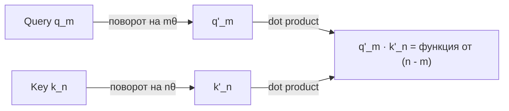

# Wiki Source-Breakdowns — Design Spec

**Дата:** 2026-05-18
**Ветка:** `wiki-overhaul`
**Статус:** draft, ждёт ревью пользователя
**Контекст:** переписывает структуру содержимого `wiki/` после того, как все 62 файла предыдущей версии были стёрты (commit `b<sha>`). Инфраструктура (`.claude/`, rules, skills, agents) остаётся; меняется модель того, что мы пишем в `wiki/`.
**Заменяет:** части предыдущего спека `2026-05-17-wiki-overhaul-design.md`, относящиеся к структуре `wiki/` и шаблонам страниц. Всё остальное из старого спека (роль, rules, write-russian, illustration policy, autodoc) остаётся в силе.

---

## TL;DR

Wiki переходит от модели «концепт = страница» (Wikipedia-style) к модели «источник = страница» (study-notes-style). Каждый paper / lecture / clip / knowledge-sharing становится отдельной страницей-разбором по жёсткому шаблону Motivation-first. Концептов как отдельных сущностей не существует — они живут внутри разборов, навигация через теги и индекс.

---

## 1. Scope

### В фундаменте

1. Новая структура `wiki/`:
   - `wiki/papers/<author>-<year>-<title>.md`
   - `wiki/lectures/<lecturer>-<title>.md`
   - `wiki/clips/<title>-<author>.md`
   - `wiki/knowledge-sharings/YYYY-MM-DD-<topic>-by-<presenter>.md`
2. Канонический шаблон страницы-разбора (Template A — Motivation-first) с обязательными и опциональными секциями.
3. Frontmatter schema: `title`, `source_kind`, `source_path`, `source_date`, `ingested`, `authors`, `tags`, `status` (+ `presenter`, `audience`, `slides` для KS).
4. Tag whitelist в `rules/04-frontmatter-schema.md`. Расширяется тем же коммитом что вводит новый тег.
5. `wiki/index.md` — сводный индекс: recent ingests + alphabetical-по-типу + by-tag groups.
6. Обновления скиллов: `wiki-ingest` (флоу под одну страницу), `wiki-lint` (новый schema), `wiki-query` (поиск через tags), `_shared/page-templates.md` (новые шаблоны), `CLAUDE.md`, `ONBOARDING.md`, `.claude/role.md`.

### Вне фундамента

- Доработка `wiki-quiz` под новый schema — следующая итерация.
- `/wiki-push` и skill-updater — отдельный цикл (как было в старом спеке §10).
- Поведение `autodoc` не меняется.
- `write-russian` и его референсы (`_shared/russian-style.md`, `_shared/illustration-policy.md`) остаются.
- `wiki-source-researcher` агент остаётся.

### Что выбрасывается

- Старая таксономия типов: `ml_concept`, `math_concept`, `method`, `topic`, `source`, `question`.
- Старые папки `wiki/{ml_concepts,math_concepts,methods,topics,sources,questions}/`. Уже стёрты предыдущим коммитом, в новом дизайне не возвращаются.
- Frontmatter поля `type`, `created`, `updated`, `sources` (integer), `needs_rewrite`.
- Концепт `wiki/topics/` (narrative primers) — нет в новой модели. Тематический синтез появляется только если пользователь явно его запрашивает; пока — out of scope.
- `wiki/questions/` — открытые вопросы живут inline в секции «Открытые вопросы» страницы-разбора.

---

## 2. Directory layout

```
knowledge_sharing_wiki/
├── CLAUDE.md
├── AGENTS.md
├── ONBOARDING.md
├── README.md
├── .autodoc/                         # без изменений
├── .claude/                          # без изменений в составе
│   ├── role.md                       # обновляется (см. §6)
│   ├── rules/                        # 04 обновляется
│   ├── agents/wiki-source-researcher.md
│   └── skills/                       # см. §6
├── raw/                              # без изменений
│   ├── papers/  clips/  lectures/  scratch/
├── wiki/
│   ├── index.md                      # сводный индекс
│   ├── log.md                        # chronological event log (как раньше)
│   ├── papers/                       # все paper-breakdowns
│   ├── lectures/                     # все lecture-breakdowns
│   ├── clips/                        # все clip-breakdowns
│   ├── knowledge-sharings/           # все KS-breakdowns
│   └── static/figures/<page-slug>/   # mermaid не нужен; matplotlib .py+.png; source cut-outs .png
└── publish/                          # Quartz, без изменений; publish/content → ../wiki
```

### Slug naming

| source_kind | Pattern | Пример |
|---|---|---|
| paper | `<first-author>-<year>-<short-title>.md` | `su-2021-roformer.md` |
| lecture | `<lecturer>-<short-title>.md` | `karpathy-makemore-3.md` |
| clip | `<short-title>-<author>.md` | `illustrated-transformer-jay-alammar.md` |
| knowledge-sharing | `YYYY-MM-DD-<topic>-by-<presenter>.md` | `2026-05-15-attention-deep-dive-by-grigoriy.md` |

KS получает префикс даты потому что встречи привязаны ко времени; остальные типы привязаны к контенту, а не дате.

### `wiki/index.md` структура

```markdown
# Wiki Index

_Last updated: YYYY-MM-DD_

## Recent ingests (last 10)

- YYYY-MM-DD [[<kind>/<slug>]] — <TL;DR одной строкой>
- ...

## Papers

- [[papers/<slug>]] — <TL;DR одной строкой>
- ... (alphabetical by slug)

## Lectures

- [[lectures/<slug>]] — <TL;DR одной строкой>
- ...

## Clips

- [[clips/<slug>]] — <TL;DR одной строкой>
- ...

## Knowledge Sharings (chronological, newest first)

- YYYY-MM-DD [[knowledge-sharings/<slug>]] — <TL;DR>
- ...

## By tag

- `attention` — [[papers/<a>]], [[lectures/<b>]], [[knowledge-sharings/<c>]]
- `positional-encoding` — ...
- ...
```

«By tag» секция собирается автоматически из frontmatter всех страниц. `wiki-ingest` обновляет индекс на phase 8.

---

## 3. Canonical template (A — Motivation-first)

### Обязательные секции (always in this order)

1. **TL;DR** — blockquote под H1. 1-3 предложения plain Russian. Что показывает источник.
2. **Мотивация** — 2-4 абзаца motivated build-up: что хотим → наивный подход → почему ломается → что предлагает источник (в одной фразе).
3. **Идея в одной картинке** — один figure + один абзац комментария. Самая важная визуализация.
4. **Как это работает** — детали. Подсекции диктуются содержанием (типично: математика, pseudocode, иллюстрации второго порядка).
5. **Вывод** — 1-3 предложения. Что взять в голову после прохождения «Как работает».
6. **Источник** — link на `raw/`, citation, дата, URL/DOI/arxiv.

### Опциональные секции

Порядок при наличии: после «Как это работает», перед «Вывод».

- **Результаты** — для paper'ов с эмпирикой. 3-7 буллетов с конкретными числами + бенчмарками. Без расплывчатых «значительное улучшение».
- **Сравнение с альтернативами** — 2-4 буллета. Каждый: «X отличается от <related-method> тем что…»
- **Ограничения** — критический взгляд: что источник умалчивает, где ломается, на чём не тестировался. Это секция автора-разбора, не пересказ авторов источника.
- **Открытые вопросы** — 1-5 буллетов нерешённых веток.
- **Связанные разборы** — 2-5 ссылок: `[[papers/<slug>]] — <why related, one line>`.

Если опциональной секции нет — она ОТСУТСТВУЕТ, а не остаётся пустой заглушкой.

### Cross-cutting правила (из `_shared/page-templates.md` и существующих rules)

- **Term introduction:** каждый новый термин на первом упоминании = bold + plain Russian def + everyday analogy. После этого — plain.
- **Formula annotation:** каждая формула получает `где: …` список с пояснением каждого символа.
- **Code-formula bridge:** нетривиальная математика сопровождается snippet (3-6 строк Python).
- **Russian prose, English structure:** rules/01.
- **One illustration per non-trivial concept:** rules/03.
- **Math in LaTeX**, не в backticks.
- **Sources cited inline:** «Su et al. (2021) показали…», никаких «эксперты считают».

---

## 4. Frontmatter schema

### Базовый блок (every page)

```yaml
---
title: <Plain title in English>
source_kind: paper | lecture | clip | knowledge-sharing
source_path: raw/<kind>/<file>
source_date: YYYY-MM-DD
ingested: YYYY-MM-DD
authors: [<First Last>, ...]
tags: [<tag1>, <tag2>, ...]
status: stub | draft | mature
---
```

### Knowledge-sharing variant (additional fields)

```yaml
---
title: <KS topic>
source_kind: knowledge-sharing
source_path: raw/knowledge-sharings/<file>
source_date: YYYY-MM-DD
ingested: YYYY-MM-DD
presenter: <First Last>
audience: <team | internal | public>
slides: <URL or relative path>           # опционально
tags: [<tag1>, ...]
status: stub | draft | mature
---
```

(Для KS поле `authors` не используется; вместо него `presenter`.)

### Правила полей

- `title` — английский, без префиксов «Paper:» или «Lecture:».
- `source_kind` — один из 4 значений; новые добавляются явным обсуждением.
- `source_path` — обязателен. `wiki-lint` проверяет существование файла.
- `source_date` — дата публикации источника (arxiv submission / lecture recording / clip publication).
- `ingested` — когда написан разбор. Бампается при substantive update.
- `authors` — массив, для лекций тоже (`[Andrej Karpathy]`).
- `tags` — lowercase kebab-case, plural where natural. 3-7 на страницу. Стабильный whitelist в `rules/04`.
- `status`:
  - `stub` — есть только TL;DR и Мотивация.
  - `draft` — все обязательные секции заполнены.
  - `mature` — пользователь ревьюнул, доволен качеством.

### Tag whitelist (стартовый набор, в `rules/04`)

```
attention
positional-encoding
normalization
optimization
regularization
generative-models
diffusion
flow-matching
variational-inference
distillation
tokenization
inference-economics
training-dynamics
```

Новые теги добавляются в whitelist тем же коммитом, что вводит первый их использующий разбор. `wiki-lint` отказывает в неизвестных тегах.

### Validation rules (enforced by `wiki-lint`)

1. Каждый файл под `wiki/{papers,lectures,clips,knowledge-sharings}/` начинается с `---` на строке 1.
2. Все базовые поля присутствуют и не пустые.
3. `source_kind` matches enclosing directory (`wiki/papers/*.md` имеет `source_kind: paper`).
4. `source_path` указывает на существующий файл под `raw/`.
5. `source_date` ≤ `ingested`.
6. `tags` — non-empty, все теги в whitelist.
7. `status` — один из трёх значений.
8. `authors` присутствует для paper/lecture/clip; `presenter` присутствует для knowledge-sharing.
9. Slug файла соответствует pattern для своего `source_kind`.

---

## 5. Concept navigation

Главный wiki-кейс: «найти всё про RoPE».

**Реализация:**

1. Каждый разбор имеет `tags: [...]` в frontmatter.
2. `wiki/index.md` секция «By tag» собирает все страницы под каждый тег. Обновляется на phase 8 ingest'а.
3. Quartz рендерит tag-страницы (`/tags/positional-encoding`) автоматически — это второй путь навигации (через сайт, не через локальный grep).
4. `wiki-query` скилл при вопросе про концепт: открыть `wiki/index.md`, найти соответствующий тег, прочитать связанные разборы, синтезировать ответ с цитатами.

**Что отсутствует** в новой модели:
- Центральные концепт-страницы (типа `[[ml_concepts/attention]]`).
- Отдельные math-walkthrough страницы. Математика живёт inline в разборе, где впервые появилась. Если очень нужен walkthrough KL divergence отдельно — ингестим лекцию/туториал про KL divergence, и это становится `lectures/<who>-kl-divergence.md`.

**Trade-off:** один концепт может объясняться повторно в разных разборах (RoPE в RoFormer paper, в YARN paper, в Karpathy lecture). Это OK — каждый разбор объясняет под углом своего источника. Дубликация цена за прозрачность «откуда что взялось».

---

## 6. Изменения в `.claude/`

### Перепись

**`.claude/skills/wiki-ingest/SKILL.md`** — флоу под одну страницу:
- Phase 4 takeaways: вместо «Likely wiki impact: create [[concept-X]], update [[concept-Y]]» — «Новая страница: `wiki/<kind>/<slug>.md`; теги: …; ключевая идея в одной фразе: …».
- Phase 5: пишется ОДНА страница по template A. Длинная лекция, покрывающая 5 концептов — всё равно одна страница с 5 подсекциями в «Как это работает».
- Phase 7 self-check: write-russian + term-introduction + formula annotation. Без изменений по сути.
- Phase 8 bookkeeping: обновить `wiki/index.md` (recent ingests + by-tag), append `wiki/log.md`, предложить atomic commit.

**`.claude/skills/_shared/page-templates.md`** — перепись:
- Удалить 6 старых шаблонов (ml_concept, math_concept, method, topic, source, question).
- Положить 2 новых: «Source breakdown — Template A» (общий для paper/lecture/clip) и «Knowledge sharing variant» (с дополнительными полями frontmatter и опциональной секцией «Q&A»).
- Cross-cutting секции (term-introduction, formula annotation, code-formula bridge) остаются как были.

**`.claude/skills/wiki-lint/SKILL.md`** — апдейт:
- Новый schema enforcement (см. §4 validation rules).
- Tag whitelist check.
- `source_path` existence check.
- Slug pattern check per `source_kind`.

**`.claude/skills/wiki-query/SKILL.md`** — апдейт:
- Стратегия поиска: open index → match tag → читать релевантные разборы → синтезировать с цитатами `[[<kind>/<slug>]]`.

**`.claude/rules/04-frontmatter-schema.md`** — перепись под §4 этого спека. Tag whitelist здесь.

**`CLAUDE.md`** — обновить layout block и упоминания концепт-страниц.

**`ONBOARDING.md`** — обновить «Structure quick map» + добавить пример страницы-разбора (короткий RoFormer skeleton как живой образец).

**`.claude/role.md`** — обновить секцию «Where new pages live»: список 4 source_kind каталогов вместо 6 type-каталогов.

### Без изменений

- `.claude/rules/01-language-policy.md`, `02-commit-policy.md`, `03-illustration-policy.md` — не зависят от структуры wiki.
- `.claude/skills/write-russian/SKILL.md`, `_shared/russian-style.md`, `_shared/illustration-policy.md` — language/visual gaidelines, не зависят.
- `.claude/skills/autodoc/SKILL.md` — не зависит.
- `.claude/agents/wiki-source-researcher.md` — research для пробелов в source'е, не зависит.

### Без изменений в этой итерации (defer)

- `.claude/skills/wiki-quiz/SKILL.md` — пока остаётся как есть. Доработка под новый schema — следующий цикл.

---

## 7. Verification

### Smoke tests

**1. Структурный sanity**
```
[ ] wiki/{papers,lectures,clips,knowledge-sharings}/ существуют (могут быть пустыми с .gitkeep)
[ ] wiki/index.md существует и парсится
[ ] wiki/log.md существует
[ ] Нет старых wiki/{ml_concepts,math_concepts,methods,topics,sources,questions}/ директорий
[ ] cd publish && npx quartz build → exit 0, без broken-link warnings
```

**2. Скиллы загружаются**
```
[ ] /wiki-ingest <known-source> проходит phase 1-2 (pre-flight + read source)
[ ] /wiki-query <known-question> возвращает результат (даже если wiki пуста — отвечает «нет данных»)
[ ] /wiki-lint без падений на пустой wiki
[ ] /autodoc без падений
```

**3. Frontmatter schema**
```
[ ] rules/04-frontmatter-schema.md описывает новый schema
[ ] Tag whitelist присутствует
[ ] _shared/page-templates.md содержит template A и KS variant
[ ] Старые шаблоны удалены
```

**4. End-to-end (user-driven)**
- Выбрать один источник из `raw/`, прогнать `/wiki-ingest`, убедиться:
  - Создалась одна страница в правильном `wiki/<kind>/` каталоге.
  - Frontmatter валиден.
  - Все обязательные секции присутствуют.
  - Идея в одной картинке — реальная иллюстрация.
  - `wiki/index.md` обновлён.
  - `wiki/log.md` дополнен.

### Definition of Done

```
[ ] Все 4 smoke-tests группы зелёные
[ ] CLAUDE.md обновлён (≤ 100 строк)
[ ] ONBOARDING.md обновлён под новый layout
[ ] .claude/role.md обновлён
[ ] .claude/rules/04 переписан
[ ] _shared/page-templates.md переписан
[ ] wiki-ingest, wiki-lint, wiki-query SKILL.md обновлены
[ ] wiki/index.md существует со скелетом
[ ] wiki/log.md существует
[ ] wiki/{papers,lectures,clips,knowledge-sharings}/ созданы с .gitkeep
[ ] git push НЕ выполнялся
```

---

## 8. Open questions

- **Glossary — нужен ли отдельный артефакт?** Сейчас term-introduction делается inline в каждой странице. Если у читателя «забыл что такое EMA», ему нужно открыть страницу где EMA впервые упоминалась. Альтернатива — single `wiki/glossary.md` с алфавитным индексом терминов и определениями. Пока без glossary — добавим при необходимости в следующей итерации.
- **Quartz tag pages** — нужны ли кастомизации поверх стандартного rendering? Пока берём дефолт Quartz.
- **Migration старого raw/** — все источники из `raw/` уже были ingested в прошлой архитектуре, и эти разборы стёрты. Заново будут ingested по мере того, как пользователь явно их запросит. Не делаем bulk re-ingest как часть фундамента.

---

## 9. Приложение: пример страницы-разбора

Чтобы шаблон не висел в воздухе — конкретный пример того, как должна выглядеть страница `wiki/papers/su-2021-roformer.md`:

```markdown
---
title: RoFormer — Enhanced Transformer with Rotary Position Embedding
source_kind: paper
source_path: raw/papers/su-2021-roformer.pdf
source_date: 2021-04-20
ingested: 2026-05-18
authors: [Jianlin Su, Yu Lu, Shengfeng Pan, Bo Wen, Yunfeng Liu]
tags: [positional-encoding, attention, transformers]
status: draft
---

# RoFormer — Enhanced Transformer with Rotary Position Embedding

> RoPE кодирует позицию токена вращением его query и key-векторов на угол, пропорциональный номеру позиции. Скалярное произведение Q·K после такого вращения зависит только от относительной позиции, а не от абсолютных индексов. На длинных контекстах работает лучше синусоидального кодирования.

## Мотивация

От позиционного кодирования нужно одно: чтобы attention видел *относительную* позицию между токенами, а не абсолютные индексы. Если токены $m$ и $n$ повторятся на позициях $m+100$ и $n+100$, dot-product между их Q и K должен остаться тем же.

Sinusoidal positional encoding (Vaswani et al. 2017) это свойство не даёт. Оно складывает позиционный вектор с эмбеддингом аддитивно, и после Q-K projection в скалярное произведение пролезают абсолютные позиции через произведение синусов.

Shaw et al. (2018) предложили learned relative position bias: добавлять к attention score обучаемый член $b_{m-n}$. Работает, но не масштабируется на длинные контексты — нужно отдельный параметр на каждый возможный сдвиг.

**RoPE предлагает третий путь:** вращать Q и K в каждой парной плоскости на угол $m\theta$, где $m$ — позиция. Свойство $R(m\theta)^\top R(n\theta) = R((n-m)\theta)$ гарантирует, что dot-product зависит только от $n-m$.

## Идея в одной картинке



*Диаграмма: ключевое свойство RoPE — скалярное произведение Q и K после поворота зависит только от относительной позиции.*

## Как это работает

### Математика

Для пары координат $(q_m^{(2i)}, q_m^{(2i+1)})$ применяется матрица поворота на угол $m\theta_i$:

$$R_{m,\theta_i} = \begin{pmatrix} \cos m\theta_i & -\sin m\theta_i \\ \sin m\theta_i & \cos m\theta_i \end{pmatrix}$$

где:
- $m$ — позиция токена (целое от 0 до длины последовательности)
- $\theta_i = 10000^{-2i/d}$ — частота для $i$-той пары измерений
- $d$ — размерность Q/K-векторов

Ключевое тождество:
$$R_{m,\theta}^\top R_{n,\theta} = R_{n-m,\theta}$$

где $R_{n-m,\theta}$ — матрица поворота на $(n-m)\theta$.

Из этого: $\langle R_{m,\theta} q, R_{n,\theta} k \rangle = q^\top R_{m,\theta}^\top R_{n,\theta} k = q^\top R_{n-m,\theta} k$ — зависит только от $n - m$.

### Pseudocode

```python
def apply_rope(x, position):
    """x: (..., d), position: scalar.
    Rotate consecutive pairs of x by m * theta_i.
    """
    d = x.shape[-1]
    theta = 10000 ** (-torch.arange(0, d, 2) / d)
    angles = position * theta
    x_even, x_odd = x[..., 0::2], x[..., 1::2]
    x_rot_even = x_even * cos(angles) - x_odd * sin(angles)
    x_rot_odd = x_even * sin(angles) + x_odd * cos(angles)
    return interleave(x_rot_even, x_rot_odd)
```

## Результаты

- На WikiText-103 RoFormer-base даёт perplexity 17.6 vs 18.0 для Vaswani-baseline (paper Table 4).
- На длинных контекстах (≥ 1024) разрыв растёт: RoPE не теряет качество, sinusoidal начинает деградировать.
- В GLUE — практически паритет, преимущества RoPE раскрываются только на длине.

## Сравнение с альтернативами

- **Sinusoidal (Vaswani 2017):** аддитивное наложение позиции на эмбеддинг. dot-product содержит абсолютную позицию. Хуже на длинных контекстах.
- **Learned relative bias (Shaw 2018):** обучаемый параметр на каждый сдвиг. Не масштабируется на $>$ 512 токенов без техник sharing'а.
- **ALiBi (Press 2021):** добавляет linear penalty к attention score по $|m-n|$. Дешевле RoPE, но даёт только monotonic decay по расстоянию.

## Ограничения

- Paper не тестирует RoPE на context length $>$ 4k. Длинные контексты появятся позже в работах про YARN и NTK-aware interpolation.
- Theoretical analysis показывает свойство относительности, но не объясняет, почему RoPE эмпирически лучше ALiBi на NLP-задачах.
- Без out-of-distribution для $m$ за пределами обучения RoPE экстраполирует плохо.

## Открытые вопросы

- Как RoPE взаимодействует с FlashAttention — нужны ли изменения в kernel?
- На каких задачах RoPE проигрывает ALiBi?

## Связанные разборы

- [[papers/peng-2023-yarn]] — расширение RoPE на context lengths за пределами обучения через NTK-aware scaling.
- [[lectures/karpathy-attention-mechanisms]] — обзорная лекция, где RoPE рассматривается рядом с альтернативами.

## Источник

- **`raw/papers/su-2021-roformer.pdf`** (paper, 2021-04-20)
- arxiv: https://arxiv.org/abs/2104.09864
- Authors: Jianlin Su, Yu Lu, Shengfeng Pan, Bo Wen, Yunfeng Liu
```
