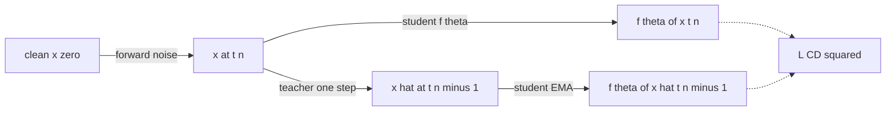

# Consistency Distillation (CD)

> Обучить [[ml_concepts/consistency-function]], используя предобученного diffusion-учителя для построения пар на траектории, и наложить self-consistency loss на эти пары.

## Motivation

Есть [[ml_concepts/diffusion-model]], которая хорошо сэмплирует, но требует 30–80 шагов [[ml_concepts/probability-flow-ode]] на изображение. Цель — student, делающий один шаг или максимум несколько. Форма student'а, которая нам нужна, — это [[ml_concepts/consistency-function]] $f_\theta(x_t, t)$, отображающий любую зашумлённую точку на траектории в её чистый endpoint $x_0$. Определяющее свойство — инвариантность вдоль траектории: $f_\theta(x_t, t) = f_\theta(x_s, s)$ для любых двух моментов $t, s$ на одной траектории. Обучить такое — и сэмплировать в один шаг.

Наивный способ это обеспечить — выбрать уровень шума $t$, попросить сеть выдать $f_\theta(x_t, t)$ и супервизировать ground-truth значением $x_0$. В принципе работает, но выбрасывает структуру, которая делает consistency models дешёвыми. Loss связывает только $x_t$ с $x_0$ — он никогда не просит сеть быть инвариантной *между двумя близкими зашумлёнными точками на одной траектории*. Без этого спаривания сеть делает one-shot регрессию из произвольного шума в чистые данные — а это ровно то, под что diffusion-учителям и понадобилось много шагов.

Чтобы получить пару, нужны две точки на одной траектории. Forward noising легко даёт $x_t$, но откуда взять подходящий $x_{t-\Delta}$? Эту задачу решает предобученный учитель. Один шаг детерминированного ODE-солвера учителя, стартовав из $(x_t, t)$, возвращает $\hat{x}_{t-\Delta}$ — следующую точку на той же траектории с точностью до truncation-ошибки солвера. Consistency distillation — ровно это: зашумить до $x_t$, прогнать один шаг учителя, чтобы получить $\hat{x}_{t-\Delta}$, применить student'а к обеим точкам, и подтянуть их выходы друг к другу. Учитель даёт только структуру — не метки — а student наследует его геометрию траектории, сжатую в один вызов сети.

## Problem setting

Доступна предобученная diffusion (или flow-matching) модель $\Phi(\cdot \mid \phi)$; нужен student $f_\theta$, способный сэмплировать за 1–4 шага.

## Algorithm

Дискретизируем временной горизонт: $t_0 < t_1 < \ldots < t_N$ (с $t_0 = \epsilon$ малым, но положительным). Один шаг обучения:

1. Сэмплируем $x_0 \sim p_{\text{data}}$ и $n \sim \mathcal{U}\{1, \ldots, N\}$.
2. Forward-noise до момента $t_n$: $x_n = x_0 + t_n\,\xi$, $\xi \sim \mathcal{N}(0, I)$. То есть $x_n \sim \mathcal{N}(x_0, t_n^2 I)$.
3. Прогоняем **один шаг** ODE-солвера учителя, чтобы получить предыдущую точку траектории:
   $$\hat{x}_{n-1} \;=\; \Phi(x_n,\, t_n,\, t_{n-1} \mid \phi).$$
4. Применяем student'а к обеим точкам и минимизируем квадратичную разность:
   $$\mathcal{L}_{\text{CD}}(\theta) \;=\; \mathbb{E}\big\lVert f_\theta(\hat{x}_{n-1}, t_{n-1}) - f_\theta(x_n, t_n) \big\rVert_2^2.$$
5. Обеспечиваем граничное условие $f_\theta(x_0, t_0) = x_0$ параметризацией $f_\theta(x, t) = c_{\text{skip}}(t) \cdot x + c_{\text{out}}(t) \cdot F_\theta(x, t)$ с $c_{\text{skip}}(t_0) = 1$, $c_{\text{out}}(t_0) = 0$.

На ветви $\hat{x}_{n-1}$ обычно ставят target-сеть (EMA $\theta$) для стабильности обучения — по образцу BYOL/TD-learning.

*Diagram: CD строит пару $(x_n, \hat{x}_{n-1})$ через forward noise + один шаг солвера учителя; student должен дать совпадающие предсказания на обоих концах.*

## Why it works

Детерминированный ODE учителя даёт единственный недостающий ингредиент — соседние точки на *одной* траектории. Без них «self-consistency вдоль траектории» нельзя обеспечить, потому что нет способа подобрать к точке в момент $t_n$ соответствующую точку в момент $t_{n-1}$. Forward noising даёт $x_n$; один шаг солвера учителя — $\hat{x}_{n-1}$. Вместе они образуют корректную пару на траектории (с точностью до truncation-ошибки солвера).

Граничное условие отсекает тривиальный $f_\theta \equiv 0$ (который иначе минимизировал бы self-consistency loss, ничего не выучив).

## Properties

- **Число шагов на inference:** 1 шаг (greedy) или 4–5 стохастических.
- **Качество vs учитель:** теряет немного качества на 1 шаге, сравнимо на 4 шагах.
- **Compute-стоимость при обучении:** один вызов учителя на шаг обучения (тот самый один шаг солвера). Пренебрежимо мала по сравнению с переобучением учителя.
- **Failure modes:** target collapse при неправильной параметризации границы; численные проблемы, если шаг солвера учителя слишком грубый.

## Variants and successors

- [[methods/consistency-training]] — выкинуть учителя; использовать прямой reference-путь.
- [[methods/multistep-consistency-model]] — ослабить «всегда проецируй в 0» до «проецируй в следующую границу».
- «Improved Techniques for Training Consistency Models» — variance-reduction и трюки с расписанием (не в этом источнике).

## Sources

- [[sources/flow-map-models-lecture]] — вывод CD-loss, трюк с граничным условием и мотивация.

## Up next

- [[methods/multistep-consistency-model]] — ослабить «всегда проецируй в $t=0$» до «проецируй в следующую границу»; возвращает большую часть качества учителя при 4 шагах inference.
- [[topics/few-step-generative-models]] — более широкая область: flow map, shortcut models, mean flow и место CD среди них.
