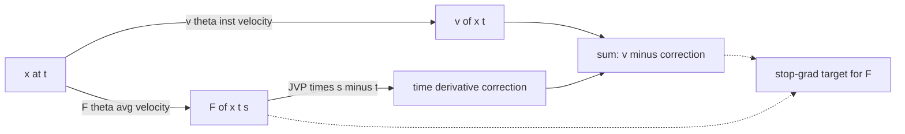

# Mean Flow

> Обучить [[ml_concepts/flow-map]] $F_\theta(x_t, t, s)$ соответствовать **средней скорости** на $[t, s]$, выразив это среднее через мгновенную скорость и производную $F_\theta$ по времени по [[math_concepts/mean-flow-identity]].

## Motivation

Цель у [[methods/shortcut-model]] и Mean Flow общая: одна сеть-[[ml_concepts/flow-map]] $F_\theta(x_t, t, s)$, способная прыгать с любого момента $t$ в любой момент $s$ за один forward pass и обучаемая без отдельного учителя. Вопрос — какую self-consistency накладывать.

ShortCut использует interval additivity: $F(t \to s) = F(t \to r \to s)$. Это корректно, но связывает две оценки сети на *разных интервалах*. Сигнал обучения на длинном интервале $[t, s]$ зависит от предсказания сети на коротком $[t, r]$, а тот сам так точен, как успела выучить сеть. Ошибки множатся по мере увеличения интервалов, и сигнал на коротких интервалах — там, где [[ml_concepts/flow-matching]]-голова якорит $F$ — должен пройти через вложенные композиции, чтобы дотянуться до далёких пар $(t, s)$.

Mean Flow меняет интегральное тождество на *дифференциальное*. Определим $F_\theta$ напрямую как среднюю скорость на $[t, s]$, домножим на $(s - t)$, продифференцируем и перенесём. Получится $F_\theta(x_t, t, s) = v(x_t, t) - (s - t)\,\tfrac{\mathrm{d}}{\mathrm{d}t} F_\theta(x_t, t, s)$. Правая часть связывает $F$ с мгновенной скоростью в *одной* точке $(x_t, t)$ плюс поправкой, считаемой как JVP через сам $F_\theta$. Второго композиционного прохода через сеть нет. Тождество поточечно по $(x_t, t)$, поэтому supervision-сигнал в каждой паре $(t, s)$ ложится прямо на FM-обученную velocity-голову — ближе к локальному ограничению, дальше от паттерна error-propagation вложенных интегралов.

## Problem setting

То же, что в [[methods/shortcut-model]]: одна сеть, произвольное число шагов inference, отдельного учителя нет. Mean Flow задаёт другой self-consistency, выведенный из *дифференциального* тождества, а не из interval additivity.

## The parametrisation

Mean Flow определяет

$$
F_\theta(x_t, t, s) \;\approx\; \frac{1}{s - t}\int_t^s v(x_u, u)\,\mathrm{d}u,
$$

то есть $F_\theta$ — **средняя мгновенная скорость** на $[t, s]$. Соответствующий шаг сэмплирования:

$$
\Psi_{t \to s}(x_t) \;\approx\; x_t + (s - t)\,F_\theta(x_t, t, s).
$$

При $s = t$ среднее вырождается в мгновенную скорость: $F_\theta(x_t, t, t) = v(x_t, t)$. Это и есть граничное условие.

## The Mean Flow Identity

Домножаем обе части на $(s - t)$ и дифференцируем по $t$. Подробный вывод проходится в [[math_concepts/mean-flow-identity]] и даёт

$$
\boxed{\;F_\theta(x_t, t, s) \;=\; v(x_t, t) \;-\; (s - t)\,\frac{\mathrm{d}}{\mathrm{d}t} F_\theta(x_t, t, s)\;}
$$

Это и есть центральный обучающий сигнал: слева — выход сети; справа — мгновенная скорость $v$ (от flow-matching головы) плюс производная $F_\theta$ по времени. $\mathrm{d}/\mathrm{d}t$ — **полная** производная вдоль траектории, поэтому

$$
\frac{\mathrm{d}}{\mathrm{d}t} F_\theta(x_t, t, s) \;=\; \partial_t F_\theta + (\partial_x F_\theta)\,v(x_t, t),
$$

что считается одним JVP через сеть (направление в $x$ задаёт $v$).

*Diagram: Mean Flow Identity супервизирует выход $F_\theta$ суммой мгновенной скорости (FM-голова) и JVP-поправки по времени.*

## Training objective

$$
\mathcal{L}_{\text{MF}}(\theta) \;=\; \big\lVert F_\theta(x_t, t, s) - \operatorname{sg}\big(v_\theta(x_t, t) - (s - t)\,\tfrac{\mathrm{d}}{\mathrm{d}t} F_\theta(x_t, t, s)\big) \big\rVert_2^2 \;+\; \mathcal{L}_{\text{FM}}.
$$

Компоненты:

- Квадратичный член — Mean Flow Identity как stop-gradient таргет: $F_\theta$ сети должен согласоваться с правой частью.
- $\mathcal{L}_{\text{FM}}$ — стандартный flow-matching loss, применённый к $v_\theta(x_t, t) = F_\theta(x_t, t, t)$. Диагональ flow map работает как velocity-голова, и та же сеть выдаёт и $v$, и $F$.

На inference: то же, что в ShortCut. Берём расписание, шагаем $x_{n-1} = x_n + (t_{n-1} - t_n)\,F_\theta(x_n, t_n, t_{n-1})$. 1 шаг работает; больше шагов улучшает качество.

## Mean Flow vs ShortCut

Оба обучают flow map $F(x_t, t, s)$ через self-consistency со stop-gradient. Разница — какое тождество накладывают:

| Method                | Identity used                                                                       | Extra cost during training |
|-----------------------|-------------------------------------------------------------------------------------|----------------------------|
| [[methods/shortcut-model]] | Интегральное: $F(t, s) \approx F(F(t, r), r, s)$ — один лишний forward pass    | 1 лишний forward           |
| [[methods/mean-flow]] | Дифференциальное: $F = v - (s - t)\,\mathrm{d}F/\mathrm{d}t$ — один JVP через сеть | 1 JVP                      |

Дифференциальное тождество даёт более поточечный сигнал; интегральное — более «глобальную» связь между интервалами.

## Properties

- **Число шагов на inference:** обычно 1–4.
- **Граница:** $F_\theta(x_t, t, t) = v_\theta(x_t, t)$, обеспечивается совместно с FM.
- **Compute:** обучение требует JVP-возможностей (PyTorch `torch.func.jvp` или аналог); inference — один forward pass на шаг.

## Variants and successors

- [[methods/shortcut-model]] — аналог через интегральное тождество.
- «Mean Flows for One-step Generative Modeling» (Geng et al., 2025) — статья, на которую ссылается лекция.

## Sources

- [[sources/flow-map-models-lecture]] — определение, Mean Flow Identity, цель обучения и диаграмма $v$, $F$ и поправочного члена $-(s - t)\,\mathrm{d}F/\mathrm{d}t$.

## Up next

- [[methods/shortcut-model]] — аналог через интегральное тождество; сравнение проясняет, что покупает дифференциальное.
- [[topics/few-step-generative-models]] — место Mean Flow среди consistency models, shortcut models и progressive distillation.
