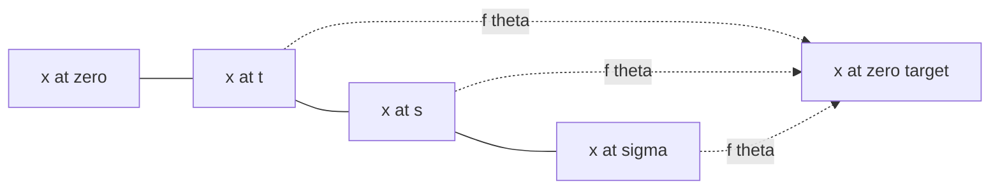

# Consistency Function

> Consistency function $f(x_t, t) \mapsto x_0$ отображает любую точку траектории probability-flow ODE в её начало при $t = 0$, так что все точки одной траектории делят один и тот же образ.

## Motivation

Хотим сгенерировать изображение $x_0$ из шума $x_\sigma$ за как можно меньшее число вызовов сети. Стандартная diffusion-модель даёт нам [[ml_concepts/probability-flow-ode]] — детерминированную кривую между этими двумя точками — но превращает сэмплирование в решение ODE, что стоит 50–200 вычислений сети поля скоростей. Сама траектория задана моделью; медленность вся в численном интегрировании искривлённого пути.

Первое, что хочется попробовать, — взять более грубый солвер. Это не работает, потому что кривая действительно нелинейна: пара больших Эйлеровских шагов либо перелетает, либо недолетает, и качество падает быстро. Дело не в солвере, а в том, что векторное поле кодирует *локальную* скорость, и один запрос в точке $(x_t, t)$ ничего не говорит о том, куда траектория в итоге придёт.

Consistency function обходит это, обучая сразу конечную точку. Определим $f_\theta(x_t, t)$ так, чтобы он отправлял любую точку траектории в её начало $x_0$. Поскольку ODE детерминирован, каждая $(x_t, t)$ лежит ровно на одной траектории, поэтому $f_\theta$ — функция, а не соответствие. С ним сэмплирование — один forward pass: подаём шум, читаем картинку. Это [[ml_concepts/flow-map]], у которого целевое время фиксировано как $s = 0$.

Тогда вопрос обучения: как супервизировать $f_\theta$, не интегрируя медленный ODE для каждого примера? Трюк — потребовать, чтобы $f_\theta$ был *постоянен вдоль каждой траектории*. Если две близкие точки $(x_t, t)$ и $(x_s, s)$ лежат на одной кривой, их предсказанные начала должны совпадать. Эта self-consistency identity, закреплённая граничным условием при $t \approx 0$, превращает «предсказать проинтегрированную точку прибытия» в локальный matching loss, не требующий полного ODE rollout на каждый шаг градиента.

## Formal description

Пусть $\{x_\tau\}_{\tau \in [0, \sigma]}$ обозначает траекторию-решение probability-flow ODE, в которой $x_0$ — чистый, а $x_\sigma$ — чистый шум. **Consistency function** — это отображение

$$
f_\theta: (x_t, t) \mapsto x_0,\qquad \forall x_t \in \{x_\tau\}_{\tau \in [0, \sigma]}.
$$

Оно должно удовлетворять **self-consistency**: для любых двух моментов $s, t \in [0, \sigma]$ на одной траектории

$$
f_\theta(x_t, t) \;=\; f_\theta(x_s, s).
$$

Эквивалентно, $f_\theta$ постоянен вдоль каждой траектории.



*Diagram: все точки одной ODE-траектории проецируются в один endpoint $x_0$ — self-consistency.*

**Boundary condition** фиксирует значение $f_\theta$ в начале траектории:

$$
f_\theta(x_0, t_0) \;=\; x_0,
$$

где $t_0$ — наименьший момент в расписании (обычно небольшое $\epsilon > 0$, не строгий ноль, из численных соображений). Граничное условие отсекает вырожденное решение $f_\theta \equiv 0$, которое иначе тривиально удовлетворяло бы self-consistency loss.

## Training objective

Дискретизируем $[0, \sigma]$ на моменты $t_0 < t_1 < \ldots < t_N$. Self-consistency loss связывает соседние моменты на одной траектории:

$$
\mathcal{L}(\theta) \;=\; \mathbb{E}_{n}\big\lVert f_\theta(x_{n-1}, t_{n-1}) - f_\theta(x_n, t_n) \big\rVert_2^2,
$$

где $(x_n, x_{n-1})$ — две соседние точки на *одной* траектории. Отсюда вопрос: откуда брать пару? Ответы делят методы на две группы:

- [[methods/consistency-distillation]] — $x_n$ берётся из forward noising-процесса, а $x_{n-1}$ получается одним шагом ODE-солвера предобученного diffusion-учителя.
- [[methods/consistency-training]] — без учителя; используется прямой reference-путь $x_\tau = x_0 + \tau\,\epsilon$ с *одинаковым* $\epsilon$ для $x_n$ и $x_{n-1}$.

Оба способа обеспечивают граничное условие $f_\theta(x_0, t_0) = x_0$, обычно через skip-connection: $f_\theta(x, t) = c_{\text{skip}}(t) \cdot x + c_{\text{out}}(t) \cdot F_\theta(x, t)$ с $c_{\text{skip}}(t_0) = 1$, $c_{\text{out}}(t_0) = 0$.

## Sampling

Consistency function — не векторное поле, поэтому стандартные ODE-солверы не работают. Две стратегии сэмплирования:

- **1-step:** $x_0 \approx f_\theta(x_N, t_N)$ с $x_N \sim \mathcal{N}(0, \sigma^2 I)$.
- **Стохастический multistep (4–5 шагов):** повторяем
  ```
  x_0 ← f_θ(x_n, t_n)
  ε   ∼ N(0, I)
  x_{n-1} ← x_0 + t_{n-1} ε
  ```
  Каждый шаг «re-noising» выбирает свежую траекторию на меньшем уровне шума, потом проецирует в её начало. Качество обычно лучше, чем у 1-step, ценой 4–5× компьюта.

## Variations and related concepts

- [[ml_concepts/flow-map]] — consistency function — это частный случай $s = 0$.
- [[methods/multistep-consistency-model]] — ослабляет «всегда проецируй в $t = 0$» до «проецируй в границу следующего интервала».
- [[methods/consistency-distillation]] — обучение с учителем.
- [[methods/consistency-training]] — обучение без учителя.

## Open questions

- [[questions/why-cant-cms-use-ode-solvers]]
- [[questions/why-does-consistency-training-work-without-teacher]]

## Sources

- [[sources/flow-map-models-lecture]] — определение, self-consistency property, граничное условие и протокол сэмплирования.

## Up next

- [[methods/consistency-distillation]] — обучать $f_\theta$ с помощью предобученного diffusion-учителя, поставляющего пары соседних моментов на траектории.
- [[methods/consistency-training]] — обучать $f_\theta$ с нуля без учителя, считывая локальную линеаризацию ODE прямо с данных.
