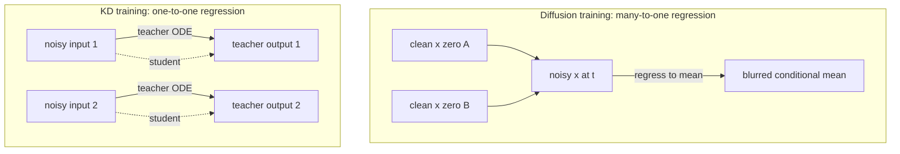

# Step Distillation

> Обучить быстрого «student»-а воспроизводить за один-два forward pass то, что медленный предобученный «teacher» (diffusion) выдаёт за полный multi-step ODE-солвер.

## Motivation

Есть [[ml_concepts/diffusion-model|diffusion-учитель]], дающий отличные сэмплы за 50–200 forward pass'ов на изображение, и хочется получать те же сэмплы за 1–4 pass'а. Просто переобучить более компактную модель с нуля на той же diffusion-loss не помогает: сама loss и заставляет делать много шагов. Глубже стоит вопрос — почему diffusion вообще медленный.

Diffusion-цель регрессирует $x_\theta(x_t, t)$ к $x_0$, но forward noising-процесс **one-to-many**: одно чистое изображение становится любым из бесконечного семейства зашумлённых $x_t$ в зависимости от выбранного $\epsilon$, и наоборот — один $x_t$ согласован со многими кандидатами в $x_0$. Минимизация квадратичной ошибки в этой many-to-one регрессии толкает сеть к условному среднему $\mathbb{E}[x_0 \mid x_t]$ — размытому глобальному среднему при высокой шумности. Один forward pass не может определиться с одной модой этого среднего, поэтому стандартный обход — делать маленькие шаги: с уменьшением $t$ условное среднее концентрируется на одной моде и предсказание становится чётким.

Step distillation убирает many-to-one структуру, а не обходит её. ODE учителя детерминирован: одному шумовому входу соответствует ровно одно изображение. Используем учителя как генератор меток — для любого $x_t$ запускаем его солвер до $x_0$ и берём это как таргет — и обучаем student'а на этих one-to-one парах. Цель регрессии теперь однозначна, поэтому один forward pass может в принципе точно её воспроизвести. Это и есть структурная причина, по которой distillation ускоряет сэмплирование.

Открыт вопрос — насколько агрессивным сделать ускорение. Сжать всю траекторию в один pass — и зазор между «что выражает один forward pass» и «что считают 50 forward pass'ов учителя» велик, качество падает. Сжимать траекторию пополам — обучать student'а делать *два* шага учителя за *один* — и итерировать; так доходим до few-step генерации без резкого падения качества. Это рецепт [[methods/progressive-distillation]]; [[methods/consistency-distillation]] идёт другим путём, заменяя явные метки учителя self-consistency identity вдоль той же траектории.

## Why diffusion is slow but distillation is fast

Diffusion-обучение оптимизирует

$$
\mathcal{L}_{\text{diff}}(\theta) \;=\; \mathbb{E}_{t, x_0, \epsilon}\big\lVert x_\theta(x_t, t) - x_0 \big\rVert_2^2,
$$

с $x_t = x_0 + t\,\epsilon$. Forward noising-процесс **one-to-many**: один $x_0$ может стать любым из бесконечного семейства $x_t$ в зависимости от $\epsilon$. Эквивалентно — один $x_t$ согласован со многими кандидатами в $x_0$. Сеть минимизирует квадратичную ошибку против всех них, поэтому её оптимум — условное среднее $\mathbb{E}[x_0 \mid x_t]$. На высокой шумности это среднее — размытое «глобальное усреднение»; один forward pass не может выбрать одну моду.

Стандартное лечение — мелкие шаги: с уменьшением $t$ условное среднее концентрируется на одной моде, и предсказания становятся чёткими. Отсюда необходимость многих шагов.

Distillation убирает many-to-one бутылку. Заменяем датасет пар $(x_t, x_0)$ из noising-процесса парами $(x_t, \hat{x}_0)$, где $\hat{x}_0 = \Phi(x_t)$ — детерминированный выход ODE-солвера учителя. Теперь на каждый вход ровно одна метка:

$$
\mathcal{L}_{\text{KD}}(\theta) \;=\; \mathbb{E}_{x_t}\big\lVert x_\theta(x_t) - \hat{x}_\phi(x_t) \big\rVert_2^2.
$$

Цель регрессии корректно определена, поэтому один forward pass в принципе может её точно повторить.

*Diagram: forward noising даёт many-to-one таргет (несколько $x_0$ согласованы с одним $x_t$); детерминированный учитель превращает это в one-to-one.*

## Variants

### One-step KD (the "holy grail")

$$
\mathcal{L}_{\text{KD}}(\theta) \;=\; \mathbb{E}_{x \sim \mathcal{N}(0, \sigma^2 I)}\big\lVert x_\theta(x) - \hat{x}_\phi(x) \big\rVert_2^2.
$$

Student отображает чистый шум напрямую в финальный сэмпл учителя. Концептуально просто, на практике трудно: выход учителя — результат длинного ODE-интегрирования, и зазор между «что выражает student за один pass» и «что учитель считает за 50 pass'ов» велик. Качество обычно отстаёт от учителя.

### Multi-step KD ([[methods/progressive-distillation]])

Обучить student'а делать *два* шага учителя за *один* шаг student'а:

$$
\mathcal{L}_{\text{KD}_m}(\theta) \;=\; \mathbb{E}_{t, x_0, x_t}\big\lVert x_\theta(x_t, t) - \hat{x}_\phi(x_t, t) \big\rVert_2^2,
$$

где $\hat{x}_\phi(x_t, t)$ — выход учителя после двух ODE-шагов из $(x_t, t)$. Итерируем: новый student становится следующим учителем, число шагов делится пополам каждый раунд. До 1- или 2-step генерации доходим за несколько раундов без резкого падения качества, характерного для one-shot one-step KD.

## Why this is a flow-map perspective

Step distillation — рецепт подгонки [[ml_concepts/flow-map]]. Student учит проинтегрированное решение ODE учителя; учитель даёт supervision. Consistency models заменяют явные rollout'ы учителя *self-consistency* loss'ом вдоль того же ODE (структурное тождество вместо явных меток), но цель — выучить проинтегрированную траекторию — та же.

## Variations and related concepts

- [[methods/progressive-distillation]] — канонический multi-step KD рецепт.
- [[methods/consistency-distillation]] — distillation в consistency function, а не в halved-step модель.
- [[ml_concepts/flow-map]] — то, что выучивается.
- [[ml_concepts/diffusion-model]] — медленный учитель.

## Sources

- [[sources/flow-map-models-lecture]] — мотивация KD, цели one-step vs multi-step KD, объяснение one-to-many vs one-to-one — почему distillation быстрее, чем обучение diffusion.

## Up next

- [[methods/progressive-distillation]] — канонический рецепт: итеративно делить число шагов пополам, обучая student'а делать два шага учителя за один.
- [[methods/consistency-distillation]] — distillation в [[ml_concepts/consistency-function]], а не в модель с урезанным числом шагов, и сэмплирование за 1–4 шага напрямую.
