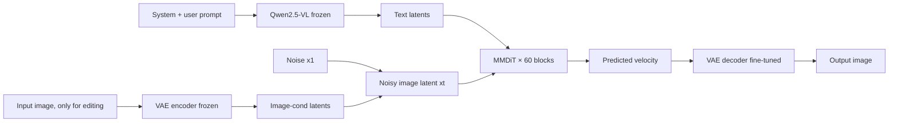
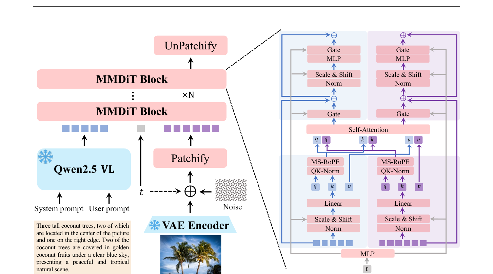
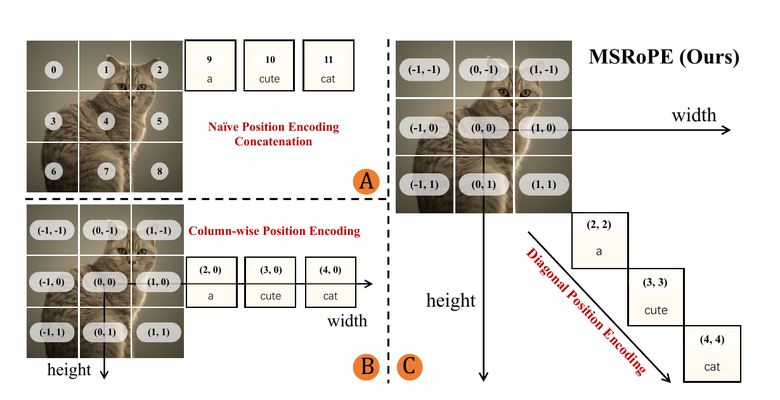
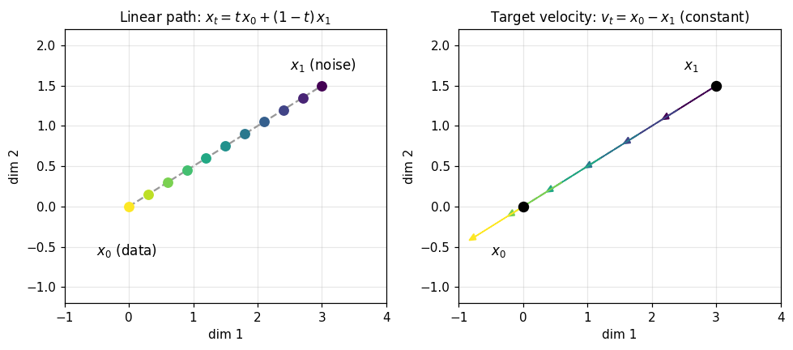
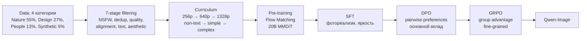
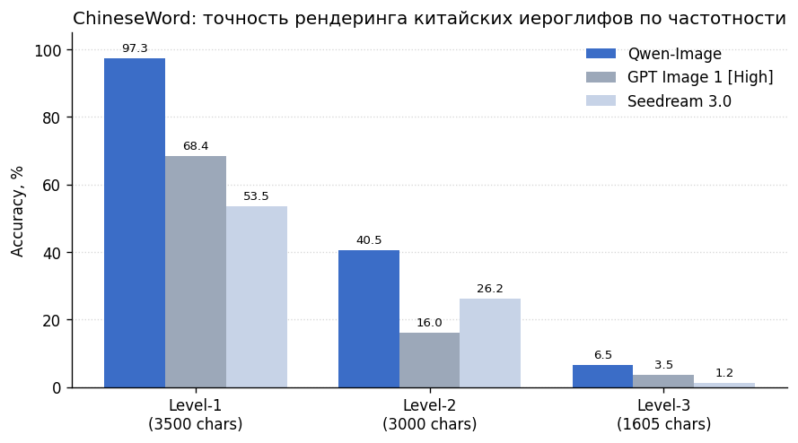

# Qwen-Image Technical Report

> Foundation-модель Qwen Team для генерации картинок по тексту и для редактирования картинок по инструкции. От FLUX и Seedream отличается тем, что заточена под сложный рендеринг текста внутри картинки — особенно китайских иероглифов. Архитектура держится на трёх частях: замороженный Qwen2.5-VL как text encoder, Wan2.1-VAE с дообученным на text-rich датасете decoder и 20B MMDiT с новым позиционным кодированием MSRoPE, которое раскладывает текстовые токены по диагонали относительно центра картинки. Pre-training — flow matching, post-training — SFT + DPO + GRPO. На бенчмарках: 88.32 на DPG, 0.91 на GenEval после RL, 7.56 на GEdit-EN; 97.29% на Level-1 китайских иероглифов против 53.48% у Seedream 3.0; третье место на AI Arena с ELO 1228 — единственная open-source модель в верхушке. В разборе: почему предыдущие способы джойнт-PE ломались, как dual-encoding (semantic от VLM + reconstructive от VAE) поддерживает consistent editing, и какую роль играет curriculum по тексту.

## Мотивация

От T2I-моделей хочется двух связанных вещей сразу. Первая — генерация картинки, в которой текст-как-объект (вывеска, подпись, абзац рукописного письма) читается. Это редкий, но критичный навык: если модель не умеет писать слова, она не годится для постеров, инфографики, обложек, UI-мокапов. Вторая — image editing по текстовой инструкции, где правка точечная: смена позы сохраняет одежду, замена фона не трогает героя, изменение цвета волос не калечит черты лица.

Прямой путь — взять SD3 / FLUX-style диффузионный T2I, заменить CLIP/T5 text encoder на VLM и обучить на больших данных. Получится модель, которая лучше следует промпту по семантике, но текст внутри картинки по-прежнему ломается, особенно для логографических языков. У китайского хвост распределения иероглифов огромный: тысячи редких знаков почти не встречаются в реальных изображениях, поэтому модель их просто не видела. С editing другая беда: VLM даёт богатую семантику, но теряет низкоуровневые детали; VAE-кодирование входной картинки удерживает детали, но без семантики не понимает инструкцию. Делать только что-то одно — терять либо detail fidelity, либо identity.

Есть и третья, более тонкая проблема — позиционное кодирование. В классическом MMDiT-блоке текстовые токены конкатенируются с image-токенами вдоль одной последовательности; image-токены получают 2D-RoPE по высоте и ширине, текст — 1D-RoPE с шагом 1. В Seedream 3.0 image-PE сдвигается в центр картинки, а text-токены получают 2D-индексы $[1, L]$ — лежат «справа» от картинки. После этого 0-й «средний» ряд позиций для текста и для центральной строки картинки становится изоморфным: модель не может различить, где текст, а где image-латент.

Qwen-Image отвечает на эти три вопроса вместе. Foundation-модель строится на трёх компонентах: Qwen2.5-VL даёт semantic-эмбеддинги входа, отдельный image-VAE (decoder дообучен на text-rich датасете) даёт reconstructive-эмбеддинги, оба потока идут параллельно в 20B MMDiT. Внутри MMDiT-блока — новое позиционное кодирование MSRoPE, которое кладёт текст на диагональ от центра картинки и сохраняет 1D-функциональность для текстовой стороны. Обучение — curriculum от non-text данных к рендерингу абзацев, с многостадийной фильтрацией.

## Идея в одной картинке



*Diagram: три модуля Qwen-Image. Qwen2.5-VL выдаёт текстовый стрим (включая описание входной картинки для editing), VAE encoder — image-стрим. Оба стрима идут вместе через 60 MMDiT-блоков, обучаемых предсказывать velocity по flow matching. VAE decoder отдельно дообучен на text-rich датасете, чтобы маленькие буквы и иероглифы восстанавливались без артефактов.*

Три замороженных компонента (Qwen2.5-VL, VAE encoder, VAE decoder — последний после fine-tuning остаётся заморожен на инференсе) делают всю «понимающую» работу. Обучаемый — только MMDiT-стек (20B параметров) и сам VAE decoder, дообучаемый отдельно. Editing получается переключением: при пустом входном изображении модель работает как чистый T2I, при наличии входа — добавляется второй image-стрим с дополнительной frame-размерностью в MSRoPE.

## Как это работает

### Архитектура: три модуля


*From Wu et al. (2025), Fig. 6.*

Слева — высокоуровневая схема, справа — внутренности одного MMDiT-блока. Двойной поток текста (синий) и картинки (фиолетовый) идёт параллельно: у каждого свои Linear и Norm, потом MS-RoPE и QK-Norm применяются к $q, k$, после чего обе тройки склеиваются в одну Self-Attention операцию. Дальше Gate, Scale&Shift, MLP — снова раздельно для двух потоков. Это и есть «double-stream» вариант MMDiT — текст и картинка делят attention, но не делят MLP.

Три core-компонента:

- **`MLLM`** (Multimodal Large Language Model) — это языковая модель, которая умеет принимать на вход не только текст, но и картинки, и выдавать выровненное скрытое представление в общем пространстве. Можно представить как **переводчика-полиглота на таможне**: ему всё равно, на каком языке к нему подходят, он одинаково описывает суть. В Qwen-Image эту роль играет Qwen2.5-VL (~7B), берётся последний скрытый слой, модель заморожена. Выбор VLM вместо чистого LLM (Qwen3) даёт две вещи: уже выровненное text-image пространство (полезно для T2I) и поддержку editing «из коробки» — картинку можно положить во вход через `<|vision_start|>...<|vision_end|>`.

- **`VAE`** (Variational AutoEncoder) — это пара encoder/decoder, которая сжимает картинку в маленький латент и потом восстанавливает обратно. Можно представить как **сжатие фотографии в JPEG**: encoder сворачивает 1024×1024 пиксель в латент ~128×128 c 16 каналами, decoder разворачивает обратно. В Qwen-Image взят Wan2.1-VAE как backbone, encoder заморожен, а decoder дообучен отдельно на text-rich корпусе (PDF, слайды, постеры) с reconstruction + perceptual loss, без adversarial loss.

- **`MMDiT`** (Multimodal Diffusion Transformer) — это диффузионный backbone, который вместо UNet использует трансформер, обрабатывающий текстовые и image-токены одновременно. Можно представить как **общий конференц-зал, где переговоры между делегациями (текст и картинка) идут в одной комнате**, но у каждой делегации свой стол и свой стенограф. 60 блоков, 24 attention-head в каждом, head size 128, intermediate size 12288, итого 20B параметров.

Точная конфигурация всех трёх модулей:

| Configuration | VLM ViT | VLM LLM | VAE Enc | VAE Dec | MMDiT |
|---|---|---|---|---|---|
| # Layers | 32 | 28 | 11 | 15 | 60 |
| # Heads (Q / KV) | 16 / 16 | 28 / 4 | — | — | 24 / 24 |
| Head Size | 80 | 128 | — | — | 128 |
| Intermediate Size | 3456 | 18 944 | — | — | 12 288 |
| Patch / Scale Factor | 14 | — | 8×8 | 8×8 | 2 |
| Channel Size | — | — | 16 | 16 | — |
| # Parameters | 7B | | 54M | 73M | 20B |

*Source: Wu et al. (2025), Table 1.*

### MSRoPE: текст на диагонали


*From Wu et al. (2025), Fig. 8.*

Три варианта позиционного кодирования для совместной последовательности «image-токены + text-токены»:

- **A — наивная конкатенация.** Image-токены получают 2D-индексы $(0,0), (0,1), \ldots, (2,2)$, текст — продолжение в виде 1D-индексов 9, 10, 11. Картинка двумерна, текст одномерен, attention видит их в разных «системах координат» — это не масштабируется на разные разрешения.

- **B — column-wise (Seedream 3.0).** Image-PE центрируется: индексы $(-1,-1)$ ... $(1,1)$. Текст получает 2D-индексы $(2, 0), (3, 0), (4, 0)$ — лежит «справа» от картинки. Это позволяет масштабировать разрешение, но 0-й ряд позиций для текста ($y=0$) и для средней строки картинки ($y=0$) дают изоморфные относительные расстояния — модель путает, где текст.

- **C — MSRoPE (Multimodal Scalable RoPE).** Текст-токены получают 2D-индексы с одинаковым значением по обеим осям: $(2,2), (3,3), (4,4)$ — то есть кладутся на диагональ относительно центра картинки. С точки зрения текста это эквивалентно 1D-RoPE (расстояние между соседними токенами одинаковое), с точки зрения image-attention текст изоморфно вкладывается в 2D-сетку, не сталкиваясь ни с одной отдельной строкой или столбцом картинки.

**`MSRoPE`** (Multimodal Scalable RoPE) — это способ кодировать позиции так, что текст и картинка делят одно 2D-пространство индексов, но текст лежит на главной диагонали. Можно представить как **разные эшелоны на сортировочной станции**: image-вагоны стоят на сетке путей, текст-вагоны — на отдельном диагональном пути, который не пересекает ни один image-путь. Для TI2I-режима появляется дополнительная frame-размерность: input image и output image различаются третьим индексом (frame=0 для входа, frame=1 для выхода).

### Dual-encoding для editing

Главная развилка для editing-моделей — как кодировать входную картинку. Один путь — только через MLLM: гарантируется семантическая когерентность (модель понимает, что на картинке), но теряются мелкие детали. Другой путь — только через VAE: детали сохраняются, но модель не понимает инструкцию вроде «поверни на 90 градусов вправо».

Qwen-Image кладёт оба:

- Входная картинка идёт в Qwen2.5-VL (как часть user prompt с `<|vision_start|>...<|vision_end|>` обёрткой). VLM выдаёт semantic-эмбеддинги: «это аниме-сцена, девочка с двумя плюшевыми игрушками, фон — магазин».
- Та же картинка идёт в VAE encoder. Получается reconstructive-эмбеддинг: координаты пикселей, текстуры, точные цвета.
- Оба набора эмбеддингов конкатенируются с шумным латентом по последовательностной размерности. MMDiT решает, какой источник важнее в каком блоке.

На бенчмарке GEdit-EN (semantic consistency + perceptual quality + overall) Qwen-Image берёт первое место с 7.56 против 7.53 у GPT Image 1 [High] и 6.97 у Step1X-Edit. На GEdit-CN разрыв ещё больше: 7.52 против 5.36 у Gemini 2.0 — большинство конкурентов на китайском editing просто не работают.

### Pre-training: flow matching

Pre-training идёт по flow matching objective.

**`flow matching`** — это способ обучить диффузионную модель без явных $\beta_t$-расписаний: модель учится предсказывать **скорость** $v_t$, с которой латент должен двигаться от шума к данным. Можно представить как **навигатор в автомобиле**: вместо того, чтобы выдавать таблицу «через 30 секунд поверни направо», он в каждый момент показывает направление движения. На инференсе сэмпл получается интегрированием ODE: $x_{t+\Delta t} = x_t + v_\theta(x_t, t, h) \Delta t$.

Формальная схема пары точка-скорость:

$$
\begin{cases}
x_t = t\,x_0 + (1-t)\,x_1 \\
v_t = \dfrac{dx_t}{dt} = x_0 - x_1
\end{cases}
$$

где:
- $x_0$ — латент картинки из data-распределения, $x_0 = \mathcal{E}(x)$, где $\mathcal{E}$ — VAE encoder.
- $x_1 \sim \mathcal{N}(0, I)$ — стандартный гауссов шум.
- $t \in [0, 1]$ — timestep, сэмплится из logit-normal распределения на $[0, 1]$.
- $x_t$ — промежуточный латент: при $t=0$ это чистый шум, при $t=1$ — чистая картинка.
- $v_t$ — target velocity: вдоль линейной интерполяции она постоянна и равна разности конечной и стартовой точек.



Левый график: для пары $(x_0, x_1)$ латент $x_t$ движется по прямой от шума к данным, $t$ растёт от 0 (фиолетовая точка — шум) до 1 (жёлтая точка — данные). Правый график: target velocity $v_t = x_0 - x_1$ одинакова в каждой точке пути — это то, что модель должна выучить предсказывать.

Loss — MSE между предсказанной скоростью и target:

$$
\mathcal{L} = \mathbb{E}_{(x_0, h) \sim \mathcal{D},\, x_1,\, t}\, \bigl\| v_\theta(x_t, t, h) - v_t \bigr\|^2,
$$

где:
- $v_\theta(x_t, t, h)$ — скорость, предсказанная MMDiT.
- $h = \phi(S)$ — guidance latent: фичи входа $S$ (текст или текст+картинка), пропущенные через Qwen2.5-VL.
- $\mathcal{D}$ — обучающая выборка пар (картинка, prompt).

В коде это выглядит коротко:

```python
# t — logit-normal sample на [0, 1], shape (B, 1, 1, 1)
x_t = t * x0 + (1 - t) * x_noise           # линейная интерполяция
v_target = x0 - x_noise                    # постоянна по t
v_pred = mmdit(x_t, t, h)                  # h = qwen25_vl(text_or_text_image)
loss = (v_pred - v_target).pow(2).mean()
```

### Post-training: DPO + GRPO

После pre-training модель проходит SFT на тщательно отобранных «чистых, ярких, фотореалистичных» картинках, а затем — две стадии RL.

**`DPO`** (Direct Preference Optimization) — это off-policy метод подгонки модели под человеческие предпочтения без явной модели наград. Можно представить как **выбор между двумя версиями черновика**: для одного промпта собирают пару «победитель / проигравший», и модель учится повышать вероятность первого относительно второго. В Qwen-Image:

$$
\mathcal{L}_{\mathrm{DPO}} = -\mathbb{E}_{h, x_0^{\mathrm{win}}, x_0^{\mathrm{lose}}, t}\, \log \sigma\bigl(-\beta\, (\mathrm{Diff}_{\mathrm{policy}} - \mathrm{Diff}_{\mathrm{ref}})\bigr),
$$

где:
- $\mathrm{Diff}_{\mathrm{policy}} = \|v_\theta(x_t^{\mathrm{win}}, h, t) - v_t^{\mathrm{win}}\|_2^2 - \|v_\theta(x_t^{\mathrm{lose}}, h, t) - v_t^{\mathrm{lose}}\|_2^2$ — разность flow-matching loss-ов на победителе и проигравшем для текущей policy.
- $\mathrm{Diff}_{\mathrm{ref}}$ — то же для замороженной reference policy.
- $\beta$ — scale-параметр, $\sigma$ — sigmoid.

Аннотаторы для одного промпта получают несколько кандидатов, выбирают best и worst. На промптах с reference-картинкой worst назначается тому, что сильно отличается от reference.

**`GRPO`** (Group Relative Policy Optimization) — это on-policy RL-метод, где advantage считается не через value-функцию, а через нормировку наград по группе сэмплов на тот же промпт. Можно представить как **рейтинг сотрудников квартала**: оценивается не каждый по абсолютной шкале, а каждый — относительно своей группы. В Qwen-Image $G$ изображений генерируются на один промпт, advantage:

$$
A_i = \frac{R(x_0^i, h) - \mathrm{mean}(\{R(x_0^j, h)\}_{j=1}^G)}{\mathrm{std}(\{R(x_0^j, h)\}_{j=1}^G)}.
$$

Чтобы flow-matching сэмплинг имел стохастику для исследования, ODE переписывается как SDE — добавляется $\sigma_t dw$ к velocity, дискретизация по Euler-Maruyama. GRPO применяется уже после DPO, на мелкомасштабном дообучении: авторы прямо пишут, что DPO даёт большую часть улучшения, а GRPO — fine-grained refinement. На GenEval это даёт +0.04 (0.87 base → 0.91 после RL) — единственная foundation-модель выше 0.90.

### Полный pipeline обучения



*Diagram: семь стадий фильтрации, multi-scale curriculum, flow-matching pre-training и две стадии RL — DPO как основной механизм улучшения, GRPO как тонкая шлифовка.*

## Данные

Корпус — миллиарды пар (image, text), разбитых на четыре категории: Nature (~55%, объекты, ландшафты, плоды, животные, интерьеры), Design (~27%, постеры, UI, слайды, искусство), People (~13%, портреты, активности, спорт) и Synthetic (~5%, специально срендеренный текст для long-tail). Synthetic-категория не содержит AI-сгенерированных картинок — только программно срендеренный текст в трёх стратегиях:

- **Pure Rendering** — иероглифы и латиница на чистом фоне по шаблонам с динамически подобранным font-size и spacing.
- **Compositional Rendering** — синтетический текст вшивается в реальные сцены (на бумаге, на доске), captions генерируются Qwen-VL Captioner.
- **Complex Rendering** — структурированные layout: PowerPoint-слайды, UI-мокапы по правилам.

Pipeline проходит семь стадий фильтрации:

1. Initial pre-training curation (256p): NSFW-фильтр, deduplication, разрешение ≥ 256, отсев битых файлов.
2. Image quality enhancement: фильтры по rotation, clarity, luma, saturation, entropy, texture.
3. Image-text alignment improvement: три split-а по подписям (raw / re-captioned через Qwen-VL Captioner / fused), CLIP- и SigLIP-фильтры на mismatched пары.
4. Text rendering enhancement: разделение на English-text / Chinese-text / other-language / non-text сплиты, добавление синтетики.
5. High-resolution refinement (640p): aesthetic-фильтр, anomaly-фильтр (водяные знаки, QR-коды).
6. Category balance + portrait augmentation: ребалансировка, добавление портретов с rich captions.
7. Balanced multi-scale training (640p + 1328p): иерархическая таксономия WordNet-style для балансировки.

Curriculum по тексту — отдельная история. Стадии: non-text → simple text (одиночные слова на ясном фоне) → compositional (текст в реалистичном контексте: рукописная записка, надпись на доске) → complex (структурированные layout).

Distributed training — Producer-Consumer framework на TensorPipe (Producer делает фильтрацию + VAE/MLLM encoding, Consumer обучает MMDiT, обмен через HTTP+RPC). FSDP не помещался — взяли Megatron-LM с 4-way tensor parallelism. Activation checkpointing отключили: экономит 11.3% памяти, но увеличивает время итерации в 3.75× — выбрали distributed optimizer как менее болезненный компромисс.

## Результаты

T2I, general generation:

| Benchmark | Qwen-Image | Best baseline | Notes |
|---|---|---|---|
| DPG (Overall) | **88.32** | Seedream 3.0 — 88.27 | First place |
| GenEval (RL) | **0.91** | Seedream 3.0 — 0.84 | Только Qwen выше 0.90 |
| OneIG-EN (Overall) | **0.539** | GPT Image 1 — 0.533 | Alignment 0.882, Text 0.891 — лидер |
| OneIG-ZH (Overall) | **0.548** | Seedream 3.0 — 0.528 | Text 0.963 — лидер |
| TIIF Bench mini (short) | 56.14 | GPT Image 1 — 75.54 | Second |

Text rendering:



Качественный разрыв виден на ChineseWord: 3 500 ходовых иероглифов Level-1 — Qwen-Image даёт 97.29% правильно срендеренных символов, Seedream 3.0 — 53.48%, GPT Image 1 — 68.37%. На Level-2 (3 000 средне-частотных) разрыв удваивается. Level-3 (1 605 редких) у всех плохо, но Qwen всё равно вдвое лучше ближайшего конкурента — за счёт curriculum по тексту и synthetic-рендеринга для long-tail.

| Benchmark | Qwen-Image | GPT Image 1 | Seedream 3.0 |
|---|---|---|---|
| CVTG-2K (EN, word acc) | 0.8288 | **0.8569** | 0.5924 |
| ChineseWord Level-1 | **97.29** | 68.37 | 53.48 |
| ChineseWord Level-2 | **40.53** | 15.97 | 26.23 |
| ChineseWord Level-3 | **6.48** | 3.55 | 1.25 |
| LongText-Bench EN | 0.943 | **0.956** | 0.896 |
| LongText-Bench ZH | **0.946** | 0.619 | 0.878 |

*Source: Wu et al. (2025), Tables 8-10.*

Image editing:

| Benchmark | Qwen-Image | Best baseline |
|---|---|---|
| GEdit-Bench EN (Overall) | **7.56** | GPT Image 1 — 7.53 |
| GEdit-Bench CN (Overall) | **7.52** | Gemini 2.0 — 5.36 |
| ImgEdit (Overall) | **4.27** | GPT Image 1 — 4.20 |
| GSO novel view (PSNR / SSIM / LPIPS) | 15.11 / 0.884 / 0.153 | CRM — 15.93 / 0.891 / 0.152 |

*Source: Wu et al. (2025), Tables 11-13.*

3D-задачи получаются «бесплатно»: при подаче picture + текст «поверни на 90° налево» Qwen-Image выдаёт корректный novel view, конкурируя со специализированными моделями (CRM, ImageDream) без отдельной 3D-головы. То же с depth estimation — на NYUv2, ScanNet, ETH3D результаты на уровне специализированных diffusion-based depth моделей.

AI Arena — открытая платформа человеческих pairwise-сравнений с 5 000 промптов и 200+ судьями (>10K оценок на каждую модель). Qwen-Image занимает третье место с ELO 1228, уступая Imagen 4 Ultra Preview 0606 и Seedream 3.0. Среди open-source — первая, разрыв с FLUX.1 Kontext [Pro] и GPT Image 1 — больше 30 ELO.

## Сравнение с альтернативами

- **vs Seedream 3.0:** одинаковая база (MMDiT + flow matching), но Qwen-Image лучше на китайском тексте (97.29% vs 53.48% на Level-1) за счёт curriculum и synthetic. По общим бенчмаркам разрыв небольшой, по text rendering CN — в 2-5 раз.
- **vs FLUX.1 [Dev/Kontext Pro]:** FLUX даёт качественную картинку, но проседает на text rendering и плохо работает с китайским editing (1.11 на GEdit-CN G_SC против 7.82 у Qwen).
- **vs GPT Image 1 [High]:** GPT держит лидерство на сложных English-промптах (TIIF, CVTG-2K). На CN-задачах и editing-консистентности Qwen впереди.
- **vs закрытые модели в целом:** Qwen-Image — единственная open-source модель в верхушке лидерборда AI Arena. Веса (20B MMDiT + VAE) лежат на HuggingFace.

## Ограничения

- **20B параметров и 60 MMDiT-блоков** — модель тяжёлая для инференса. В техническом отчёте нет цифр по времени генерации одной картинки и по требованиям к памяти; для разворачивания нужно делать tensor parallelism, что добавляет inference-цены.
- **Reasoning остаётся слабым местом.** На OneIG-EN категория Reasoning у Qwen-Image — 0.306 против 0.345 у GPT Image 1 (best); GenEval Position 0.87 сильно, но Counting 0.93 ещё не SOTA.
- **GRPO применяется на маленьких данных** — авторы прямо говорят, что DPO даёт большую часть улучшения, а GRPO — fine-grained refinement. Полноценное RL c reward-моделью на больших масштабах — открытый вопрос.
- **MSRoPE формальной доказанной выгоды над column-wise не имеет**: статья мотивирует диагональ изоморфностью, но ablation «column-wise vs diagonal» в выложенной версии нет — есть только финальные бенчмарки модели в целом.
- **Reproducibility частичная.** Веса 20B MMDiT и VAE опубликованы, но pipeline сборки данных, синтетика для китайского, конкретные temperatures DPO — описаны словами, не воспроизводимо «как есть».
- **VAE decoder специально натаскан на text-rich** — на художественных изображениях с очень высокими частотами (например, ткани с мелкой структурой) trade-off против reconstruction-quality этой части не показан.

## Связанные разборы

- [[papers/vaswani-2017-attention-is-all-you-need]] — Transformer как родоначальник всего, включая MMDiT-блоки. Self-attention над текстом и картинкой здесь та же самая операция, только с двумя стримами проекций.
- _stub:_ Esser et al. 2024 (SD3 / MMDiT origins) — Qwen-Image берёт архитектуру блоков отсюда.
- _stub:_ Liu et al. 2022 (Rectified Flow) — flow matching loss.
- _stub:_ Su et al. 2021 (RoPE) — базовое позиционное кодирование, на котором надстраивается MSRoPE.
- _stub:_ Rafailov et al. 2023 (DPO), Shao et al. 2024 (GRPO) — два RL-метода post-training.

## Вывод

Qwen-Image — первый open-source T2I-фундамент, который одинаково сильно работает на трёх задачах разом: T2I-генерация, instruction-based editing и «бесплатное» решение 3D-задач вроде novel view и depth через image editing. Главное архитектурное решение — dual-encoding входной картинки (semantic от VLM + reconstructive от VAE) — даёт consistent editing там, где раньше приходилось выбирать одно из двух. Главный data-инсайт — text rendering ломается из-за long-tail редких символов, и лечится curriculum-ом плюс целенаправленным синтетическим рендерингом. Главный архитектурный твик — MSRoPE — конкретная фиксация конкретной проблемы (изоморфность text-PE и средней строки image-PE), которая помогла обучаться на разных разрешениях без потери различения модальностей.

## Источник

- **`raw/papers/qwen-image-2025.pdf`** (paper, 2025-08-04)
- arXiv: [2508.02324](https://arxiv.org/abs/2508.02324)
- Code: [github.com/QwenLM/Qwen-Image](https://github.com/QwenLM/Qwen-Image)
- Weights: [huggingface.co/Qwen/Qwen-Image](https://huggingface.co/Qwen/Qwen-Image)
- Authors: Qwen Team — Chenfei Wu, Jiahao Li, Jingren Zhou, Junyang Lin, Shuai Bai et al.
