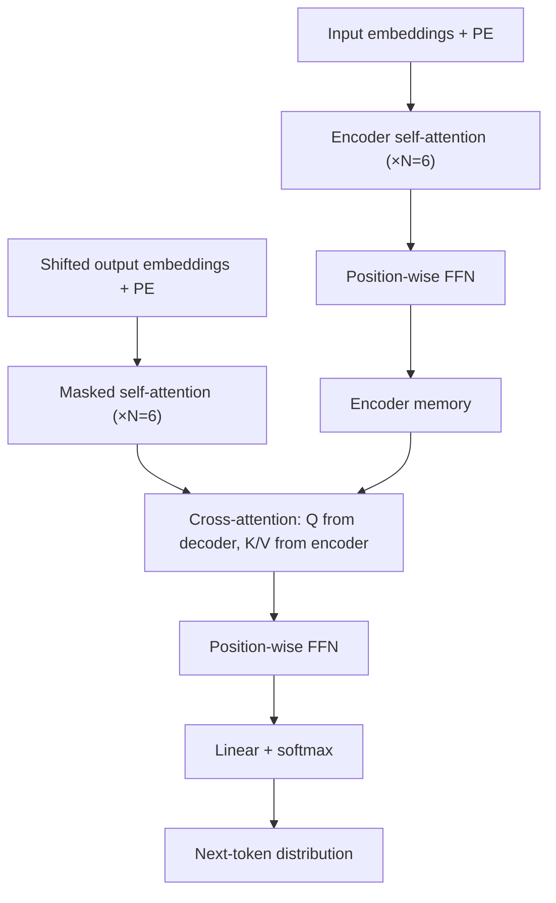

# Attention Is All You Need

> Машинный перевод к 2017 году упёрся в рекуррентность: LSTM нельзя считать параллельно по токенам, и сигнал между далёкими словами доходит через десятки шагов, теряясь по пути. Авторы выкидывают рекуррентность и свёртки целиком, оставляя только self-attention плюс синусоидальные позиционные кодирования. Big-модель берёт 28.4 BLEU на WMT'14 EN-DE — это +2.0 BLEU к лучшему ансамблю — обучаясь 3.5 дня на 8 P100 (в 4-10 раз дешевле предыдущих SOTA по FLOPs). С тех пор архитектура стала фундаментом всей LLM-эры: GPT, BERT, LLaMA, Mistral — это всё тот же стек encoder/decoder; пересматривались только attention-варианты (RoPE, ALiBi, MQA/GQA, FlashAttention), а скелет остался. В этом разборе: почему именно scaled dot-product и зачем делитель $\sqrt{d_k}$, как три способа применения attention (encoder self / decoder masked / cross) собираются в один энкодер-декодер, как устроены синусоидальные positional encodings и почему позже их заменили, и что показывает Table 1 — главное численное сравнение с RNN и ConvS2S по сложности и длине пути.

## Мотивация

К 2017 году seq2seq для машинного перевода (`neural machine translation`, NMT) строился на рекуррентных сетях — LSTM или GRU, обёрнутых в энкодер-декодер. Идея простая: энкодер по очереди читает все токены входного предложения, складывает их смысл в скрытое состояние $h_t$, декодер потом разворачивает это состояние обратно в токены перевода. У такой схемы две системные проблемы, которые упирали NMT в стену.

**Первая — обучение нельзя параллелизовать по длине последовательности (sequence length).** Скрытое состояние $h_t$ зависит от $h_{t-1}$ и текущего входа $x_t$, поэтому шаги вдоль одного предложения считаются строго последовательно: пока не готов $h_{t-1}$, считать $h_t$ нечем. Если в батче 64 предложения по 50 токенов, GPU молотит 50 шагов один за другим, а 64 примера батча — параллельно. На длинных последовательностях это убивает throughput: каждое удлинение предложения вдвое прямо удваивает время одного шага обучения.

**Вторая — длина пути.** **Длина пути** (`max path length`) — это сколько последовательных операций нужно градиенту, чтобы дойти от выхода до самого дальнего входного токена. Можно представить как **число пересадок в метро** между двумя станциями: чем больше пересадок, тем больше шансов потеряться по дороге и тем дольше едет сигнал. Для RNN путь от первого токена до последнего — $O(n)$ операций через скрытое состояние, и на каждой операции вектор $h_t$ перепакуют и частично затрут. Это значит, что для слова в начале предложения градиент к моменту его обновления уже сильно зашумлён — модель плохо учится использовать дальние зависимости.

Attention, добавленное к RNN ещё в 2015-м (Bahdanau et al.), частично закрывает вторую проблему: декодер при генерации каждого выходного слова смотрит на все скрытые состояния энкодера сразу, минуя рекуррентность. Но скелет архитектуры всё равно рекуррентный, и первая проблема — нет параллелизма по длине — остаётся.

Альтернативные подходы 2016-2017 — ByteNet, ConvS2S — заменяют рекуррентность стэком свёрток (`convolutional layers`). Свёртку можно посчитать параллельно по всем позициям сразу, и проблема параллелизма уходит. Но длина пути всё равно растёт с длиной предложения: чтобы токен на позиции 1 повлиял на токен на позиции $n$, нужно стэкнуть достаточно слоёв, чтобы рецептивное поле достигло $n$ — линейно для ConvS2S ($O(n/k)$ слоёв при ядре $k$), логарифмически для ByteNet ($O(\log_k n)$).

Идея авторов: убрать и рекуррентность, и свёртки. Оставить только self-attention — операцию, в которой каждый токен напрямую смотрит на все остальные за один шаг. Тогда длина пути становится константой $O(1)$ независимо от длины предложения, а слой считается полностью параллельно. Остальная статья — про то, как именно собрать из этой одной операции рабочий энкодер-декодер.

## Идея в одной картинке



*Diagram: Transformer как два стека по 6 идентичных блоков. Энкодер сжимает вход в матрицу memory, декодер генерирует выход авторегрессивно, заглядывая в свой прошлый префикс (masked self-attention) и в энкодерную memory (cross-attention).*

Картинка важна тем, что вычерчивает три разные роли attention в одной архитектуре: на левой колонке энкодер строит контекстуальное представление каждого входного токена, на правой декодер делает то же самое для выхода (но только глядя «налево»), а средняя стрелка из энкодера в декодер — это и есть классический cross-attention из Bahdanau-2015, который мостит вход и выход.

## Как это работает

### Scaled dot-product attention

Базовый блок — функция, которая по матрице запросов $Q$, ключей $K$ и значений $V$ возвращает контекстные представления.

**Attention** — это операция, которая для каждой строки $Q$ считает её похожесть на каждую строку $K$, превращает похожести в распределение через softmax и берёт взвешенное среднее строк $V$. Можно представить как **запрос в архиве**: запрос (Q) сравнивают с ярлыками папок (K), решают, в какой папке сколько внимания взять, и возвращают смешанное содержимое (V). В трансформере она применяется в трёх разных конфигурациях — это и есть ключевая универсальность: один и тот же блок собирает контекст внутри входа (encoder self), внутри выхода (decoder masked self) и между ними (cross).

$$\text{Attention}(Q, K, V) = \text{softmax}\!\left(\frac{Q K^\top}{\sqrt{d_k}}\right) V$$

где:
- $Q \in \mathbb{R}^{n \times d_k}$ — матрица запросов; одна строка на токен
- $K \in \mathbb{R}^{m \times d_k}$ — матрица ключей
- $V \in \mathbb{R}^{m \times d_v}$ — матрица значений
- $d_k$ — размерность ключей и запросов
- $\sqrt{d_k}$ — нормирующий делитель, обоснование ниже
- $n$ — число запросов (длина запрашивающей последовательности)
- $m$ — число пар ключ-значение (длина memory)

```python
# Scaled dot-product attention
def attention(Q, K, V, mask=None):
    scores = Q @ K.transpose(-2, -1) / math.sqrt(Q.size(-1))
    if mask is not None:
        scores = scores.masked_fill(mask == 0, float("-inf"))
    weights = scores.softmax(dim=-1)
    return weights @ V
```

### Зачем делитель $1/\sqrt{d_k}$

Если компоненты $q$ и $k$ — независимые с дисперсией 1 и средним 0, то скалярное произведение $q \cdot k = \sum_{i=1}^{d_k} q_i k_i$ имеет дисперсию $d_k$. На больших $d_k$ распределение скалярных произведений сильно растягивается, в softmax попадают величины с большим разбросом, и распределение схлопывается в почти one-hot: один вес близок к 1, остальные близки к 0. У softmax в такой области градиент почти ноль, и обучение стоит. Делитель $1/\sqrt{d_k}$ возвращает дисперсию к 1.


*Generated: figures/vaswani-2017-attention-is-all-you-need/softmax-saturation.py*

На графике видно две стороны эффекта. Слева — гистограммы $q \cdot k$ для трёх $d_k$: стандартное отклонение растёт как $\sqrt{d_k}$ (примерно 2, 8, 32 при $d_k = 4, 64, 1024$). Справа — энтропия softmax-распределения по 64 ключам в зависимости от $d_k$: без скейлинга при $d_k = 1024$ распределение схлопывается почти в one-hot (около 0.2 бита из теоретических 6), со скейлингом $1/\sqrt{d_k}$ держится около 5.3 бит независимо от $d_k$ — softmax остаётся «мягким» и пропускает градиент.

### Multi-Head Attention

Одной головы недостаточно: усреднение по softmax замывает разные типы зависимостей в одно среднее. Скажем, в одном предложении нужно одновременно отследить (а) согласование подлежащего и сказуемого, (б) на какое существительное ссылается местоимение, (в) границу придаточного — это три разных функции, и одна softmax-голова, делящая 100% веса между ключами, вынуждена «компромиссировать» между ними.

Авторы решают это многоголовым вниманием (`multi-head attention`): прогоняют attention $h=8$ раз параллельно с разными проекциями $W^Q_i$, $W^K_i$, $W^V_i$ в подпространство размерности $d_k = d_v = d_{\text{model}}/h = 64$, конкатенируют результаты и пропускают через ещё одну линейную проекцию $W^O$. Каждая голова работает в своём пространстве, может выучить свою функцию и не мешает другим.

$$\text{MultiHead}(Q, K, V) = \text{Concat}(\text{head}_1, \ldots, \text{head}_h) W^O, \quad \text{head}_i = \text{Attention}(Q W^Q_i, K W^K_i, V W^V_i)$$

где:
- $h = 8$ — число параллельных голов в base-модели
- $d_{\text{model}} = 512$ — размерность представлений во всей сети
- $W^Q_i, W^K_i \in \mathbb{R}^{d_{\text{model}} \times d_k}$ — проекции для $i$-й головы
- $W^V_i \in \mathbb{R}^{d_{\text{model}} \times d_v}$ — проекция значений
- $W^O \in \mathbb{R}^{h d_v \times d_{\text{model}}}$ — финальная проекция после конкатенации

За счёт того, что $d_k = d_{\text{model}}/h$, суммарная стоимость восьми голов та же, что у одной головы полной ширины. Что покупается — видно на attention map из приложения статьи: разные головы учат разные функции (одна следит за длинными зависимостями глагола, другая — за анафорой местоимений, третья — за синтаксической границей фразы).

### Три способа применения attention в Transformer

1. **Encoder self-attention.** $Q$, $K$, $V$ — выход предыдущего энкодерного слоя. Любая позиция энкодера видит любую другую. Используется, чтобы каждый входной токен собрал контекст со всего предложения.
2. **Decoder masked self-attention.** $Q$, $K$, $V$ — выход предыдущего декодерного слоя, но в матрице scores все элементы выше главной диагонали заменены на $-\infty$ перед softmax. Это сохраняет авторегрессивность: позиция $i$ видит только позиции $1..i$, иначе при обучении модель «подсматривает» правильный ответ.
3. **Cross-attention (encoder-decoder).** $Q$ — выход предыдущего декодерного слоя, $K$ и $V$ — выход энкодера. Это та самая классическая «attention из Bahdanau», но теперь — единственный канал связи между энкодером и декодером.

### Positional Encoding

Self-attention коммутативна по позициям: перетасуйте входные токены — выходные представления тоже просто перетасуются. Это серьёзная проблема для языка, где «собака укусила человека» и «человек укусил собаку» означают разное. Чтобы модель знала порядок, к эмбеддингам прибавляют **позиционное кодирование** (`positional encoding`, PE) — это вектор, кодирующий номер позиции $\text{pos}$ в той же размерности $d_{\text{model}}$. Можно представить как **штампик с временем** на каждом письме в почтовом отделении: само письмо (эмбеддинг токена) не знает, когда оно пришло — штамп добавляет эту информацию явно.

Авторы используют синусоиды разной частоты:

$$PE_{(\text{pos},\, 2i)} = \sin\!\left(\frac{\text{pos}}{10000^{2i/d_{\text{model}}}}\right), \quad PE_{(\text{pos},\, 2i+1)} = \cos\!\left(\frac{\text{pos}}{10000^{2i/d_{\text{model}}}}\right)$$

где:
- $\text{pos}$ — индекс позиции токена, $0, 1, 2, \ldots$
- $i$ — индекс пары измерений, $0 \le i < d_{\text{model}}/2$
- $10000$ — масштаб длины волны: для $i=0$ длина волны $2\pi$, для $i = d_{\text{model}}/2$ — около $20000 \cdot \pi$

Идея — для любого фиксированного сдвига $k$ позиция $\text{pos}+k$ выражается линейной комбинацией компонент $\text{pos}$ (формулы синуса и косинуса суммы). Тем самым модели легче учить относительные позиции. Авторы пробовали и обучаемые PE — Table 3, строка (E) — BLEU практически тот же, но синусоиды экстраполируются за пределы длин из обучения.

### Position-wise FFN, residual, LayerNorm

После каждого attention-блока идёт **позиционная FFN** (`position-wise feed-forward network`) — это двухслойная сеть с ReLU между ними, применяемая независимо к каждой позиции:

$$\text{FFN}(x) = \max(0,\, x W_1 + b_1) W_2 + b_2$$

где:
- $W_1 \in \mathbb{R}^{d_{\text{model}} \times d_{ff}}$, $d_{ff} = 2048$ — расширение
- $W_2 \in \mathbb{R}^{d_{ff} \times d_{\text{model}}}$ — сжатие обратно

«Position-wise» здесь — буквально: одна и та же FFN применяется к каждой позиции по отдельности; смешивание между позициями делает только attention. Можно смотреть на это как на свёртку с ядром 1.

Каждый sub-layer (attention или FFN) обёрнут в остаточную связь (`residual connection`) и LayerNorm:

$$y = \text{LayerNorm}(x + \text{Sublayer}(x))$$

Остаточная связь нужна, чтобы градиент проходил мимо attention/FFN, не задавая ему высоких требований к точному выходу — sub-layer учит только «дельту» к входу. LayerNorm нормирует активации внутри одной позиции (по $d_{\text{model}}$), не смешивая батч и позиции, — это критично, потому что батч-статистики на разных длинах последовательностей нестабильны. В оригинальной статье — post-norm (LayerNorm после residual); вся современная практика (GPT-2 и далее) перешла на pre-norm, который устойчивее обучается на глубоких стэках.

## Результаты

- **WMT'14 EN-DE.** Transformer (big) — 28.4 BLEU, +2.0 BLEU над лучшим ансамблем (ConvS2S Ensemble — 26.36). Base-модель — 27.3 BLEU, уже выше любого предыдущего одиночного результата.
- **WMT'14 EN-FR.** Transformer (big) — 41.8 BLEU, новый single-model SOTA. Стоимость обучения — $2.3 \cdot 10^{19}$ FLOPs, примерно в 4 раза меньше, чем у предыдущего лидера GNMT + RL Ensemble.
- **Стоимость обучения.** Base-модель — $3.3 \cdot 10^{18}$ FLOPs, в 10-30 раз меньше других подходов в таблице 2.
- **Время.** Base — 100k шагов за 12 часов на 8 P100. Big — 300k шагов за 3.5 дня.
- **Перенос задачи.** На English constituency parsing (WSJ) 4-слойный Transformer выдаёт 91.3 F1 в supervised-режиме и 92.7 F1 в semi-supervised, без задачно-специфичной настройки.

## Сравнение с альтернативами

| Слой | Сложность на слой | Sequential ops | Max path length |
|---|---|---|---|
| Self-attention | $O(n^2 \cdot d)$ | $O(1)$ | $O(1)$ |
| Recurrent (LSTM/GRU) | $O(n \cdot d^2)$ | $O(n)$ | $O(n)$ |
| Convolutional (kernel $k$) | $O(k \cdot n \cdot d^2)$ | $O(1)$ | $O(\log_k n)$ |
| Self-attention (restricted, окно $r$) | $O(r \cdot n \cdot d)$ | $O(1)$ | $O(n/r)$ |

*Source: Vaswani et al. (2017), Table 1.*

- **vs RNN/LSTM.** Self-attention не имеет последовательных операций внутри слоя ($O(1)$ против $O(n)$) и видит весь контекст за один хоп. При $n < d$ (типичный случай в NMT — $n \approx 50$, $d = 512$) self-attention ещё и дешевле по флопсам на слой.
- **vs ConvS2S.** Convolutional layer с ядром $k$ нужно стекать $O(n/k)$ или $O(\log_k n)$ раз, чтобы получить рецептивное поле длиной $n$. Каждый слой стоит $O(k \cdot n \cdot d^2)$ — фактор $k$ дороже attention.
- **vs additive attention** (Bahdanau, 2015). Аналогичная сложность, но dot-product можно посчитать одним матричным произведением — на современных GPU это в разы быстрее.
- **Restricted self-attention.** Для очень длинных последовательностей предлагается ограничивать окно вокруг каждой позиции — компромисс, который ломает $O(1)$ path length, но снимает квадратичную стоимость. В статье — план на будущее.

## Ограничения

- **Квадратичная стоимость по длине.** Attention матрица — $n \times n$. Для $n = 50$ это копейки, для $n = 10000$ — десятки гигабайт на одну голову, и весь трюк с параллелизмом тонет в памяти. Restricted attention и его наследники (Longformer, Performer, FlashAttention) — реакция на это.
- **Нет встроенного смещения к локальности.** RNN и свёртки структурно «знают», что близкие позиции связаны сильнее. Transformer этого не знает и должен учить с нуля, что обычно требует больше данных.
- **Sinusoidal vs learned PE — не до конца обоснован выбор.** В Table 3 разница в BLEU между двумя вариантами — в пределах шума. Гипотеза об экстраполяции за пределы длин обучения проверена только косвенно; последующие работы (RoPE, ALiBi) показали, что синусоиды экстраполируются хуже, чем казалось.
- **Фиксированный max context.** Сам Transformer не задаёт его, но в реализациях позиционное кодирование считают для конкретной длины — на превышении нужно либо переобучать PE, либо обрабатывать аккуратно.
- **Интерпретируемость attention — слабый аргумент.** Авторы намекают, что attention-веса показывают, что модель «делает», но дальнейшие работы (Jain & Wallace, 2019) показали, что вес attention не равен причинному вкладу.

## Связанные разборы

- [[papers/su-2021-roformer]] — RoPE как замена sinusoidal PE; решает ту же задачу относительных позиций иначе (стаб, ещё не разобран).

## Вывод

Самое важное на странице — таблица 1: self-attention одновременно убирает sequential dependency внутри слоя и сокращает максимальную длину пути до $O(1)$. RNN не делал ни первого, ни второго; ConvS2S — первое, но не второе. Остальное в статье — инженерия, без которой эта идея не вытянула бы SOTA: скейлинг $1/\sqrt{d_k}$ против насыщения softmax, multi-head для разных типов зависимостей, residual+LayerNorm для устойчивого обучения глубокого стека, синусоидальные PE как замена «памяти о позиции», которая раньше жила в рекуррентности.

## Источник

- **`raw/papers/vaswani-2017-attention-is-all-you-need.pdf`** (paper, 2017-06-12)
- arXiv: [1706.03762](https://arxiv.org/abs/1706.03762)
- Authors: Ashish Vaswani, Noam Shazeer, Niki Parmar, Jakob Uszkoreit, Llion Jones, Aidan N. Gomez, Łukasz Kaiser, Illia Polosukhin
- Venue: NeurIPS 2017 (Long Beach)
